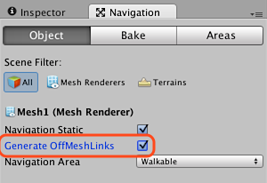
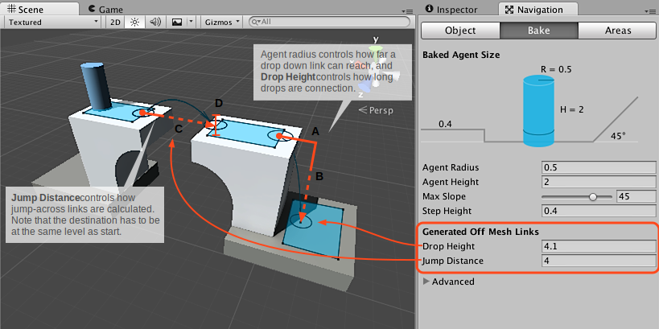

#自动构建网格外链接

可自动检测网格外链接 (Off-Mesh Link) 的一些用例。两个最常见的用例为：_掉下 (Drop-Down)_ 和_跳过 (Jump-Across)_。

- **掉下**链接的作用是从平台上掉下。
- **跳过**链接的作用是跳过缝隙。

为了自动找到跳跃位置，构建过程沿着导航网格的边缘行走，并检查跳跃的着陆位置是否在导航网格上。如果跳跃轨迹畅通无阻，则会创建网格外链接。

让我们来设置网格外链接的自动生成。如果您不熟悉导航网格烘焙，请查看[构建导航网格](nav-BuildingNavMesh.html)。

 

首先，需要标记场景中的跳跃_起始位置_对象。为此，需要在 _Navigation 窗口_中的 _Objects_ 选项卡下选中 **Generate Off-Mesh Links** 选项。

 

第二步是设置掉下和跳过轨迹：

- **掉下**链接的生成由 Drop Height 参数控制。该参数可控制将要连接的最高掉落高度，将值设置为 0 将禁用生成。
    - 定义掉下链接的轨迹时应使水平行程 **(A)** 为：_2\*agentRadius + 4\*voxelSize_。即，掉落将刚好落在平台的边缘之外。此外，垂直行程 **(B)** 需要大于烘焙设置的 _Step Height_（否则只会走下平台）并小于 _Drop Height_。应按体素大小进行调整，确保在体素化期间的任何舍入误差都不会阻止生成链接。应将 _Drop Height_ 的值设置得比在关卡中测量的值略大，使链接正确连接。
- **跳过**链接的生成由 _Jump Distance_ 参数控制。该参数可控制将要连接的最远距离。将值设置为 0 将禁用生成。
    - 定义跳过链接的轨迹时应使水平行程 **(C)** 大于 _2\*agentRadius_ 且小于 Jump Distance。此外，着陆位置 **(D)** 不得超过距离起始位置关卡的 voxelSize。

现在已经标记对象并调整了设置，因此该按 _Bake_ 按钮了，随即自动生成网格外链接！当您更改场景并烘焙时，旧链接将被丢弃，并将根据新场景创建新链接。

##故障排除

如果未在所需位置生成网格外链接，请注意以下几点：

- _Drop Height_ 应当比在关卡中测量的实际距离略大一点。这样可确保在导航网格烘焙过程中发生的小偏差不会阻止链接的连接。
- _Jump Distance_ 应当比在关卡中测量的实际距离略远一点。Jump Distance 是从导航网格上的一个位置到导航网格上的另一个位置之间的测量值，这意味着应加上 _2\*agentRadius_（加一点）才能确保跨过缝隙。

###阅读更多信息

- [创建网格外链接](nav-CreateOffMeshLink.html) - 了解如何手动创建网格外链接。
- [构建导航网格](nav-BuildingNavMesh.html) – 关于导航网格烘焙的工作流程。
- [烘焙设置](nav-AdvancedSettings.html) – 导航网格烘焙设置的完整描述。
- [网格外链接组件参考](class-OffMeshLink.html) – 所有网格外链接属性的完整描述。
- [网格外链接脚本参考](../ScriptReference/AI.OffMeshLink.html) - 网格外链接脚本 API 的完整描述。
