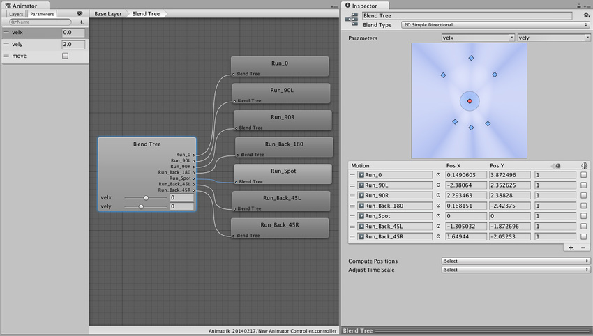
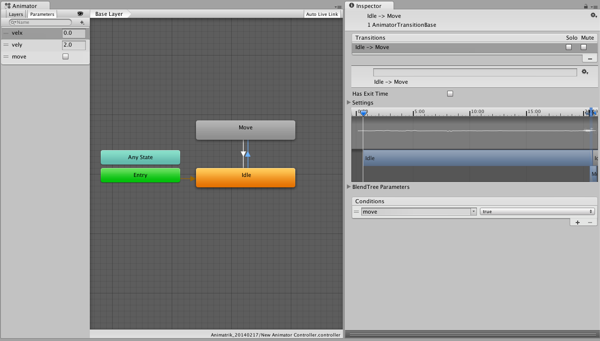

#耦合动画和导航

本文档的目标是指导您设置人形角色的导航以使用导航系统进行移动。

我们将使用 Unity 的内置动画和导航系统以及自定义脚本来实现这一目标。

本文假设您已熟悉 Unity 和 Mecanim 动画系统的基础知识。

此处提供了一个示例项目，因此无需从头开始添加脚本或设置动画和动画控制器：

- [NavigationAnimation_53.zip](../uploads/Examples/NavigationAnimation_53.zip) *适用于 Unity 5.3+*


##创建动画控制器

为了获得响应迅速且多功能的动画控制器（涵盖各种动作），我们需要一组向不同方向移动的动画。有时将其称为扫射集 (strafe-set)。

除了移动动画，我们还需要一段站立角色的动画。

我们继续将扫射集组织在 2D 混合树中；选择混合类型：**2D Simple Directional**，并使用 **Compute Positions > Velocity XZ** 放置动画

为进行混合控制，我们添加两个浮点参数 **velx** 和 **vely**，并将它们分配给混合树。

在这里，我们将放置 7 段奔跑动画，每段都有不同的速度。除了前进（+左/右）和后退（+左/右），我们还使用了原地奔跑的动画剪辑。后者在下面的 2D 混合图的中心位置进行了突出显示。采用原地奔跑动画有两个原因，首先，该动画可在与其他动画混合时保持奔跑风格；其次，该动画可以防止混合时出现脚滑。

 

然后，我们在空闲节点 (**Idle**) 本身中添加空闲动画剪辑。
我们现在有两个独立动画状态，我们将它们与 2 个过渡耦合。

 

为了控制移动状态和空闲状态之间的切换，我们添加一个布尔值控制参数 **move**。然后，对过渡禁用 **Has Exit Time** 属性。如此便可在动画期间的任何时间触发过渡。为获得快速响应的过渡，过渡时间应设置为约 0.10 秒。

 

现在将新创建的动画控制器放在要移动的角色上。

按 Play 并在 **Hierarchy 窗口**中选择该角色。现在可在 **Animator 窗口**中手动控制动画值，并更改移动状态和速度。

下一步是创建其他控制动画参数的方法。

##导航控制

在角色上放置一个 **NavMeshAgent** 组件，调整半径和高度，并匹配角色（另外更改速度属性以匹配动画混合树中的最大速度）。

为放入角色的场景创建导航网格。

接下来，我们需要告诉角色要导航的目标。此设置通常与具体应用有非常大的关联性。在这里，我们选择“单击进行移动”(click to move) 行为：根据用户点击屏幕的位置，角色移动到世界中的相应点。

````
// ClickToMove.cs
using UnityEngine;
using UnityEngine.AI;

[RequireComponent (typeof (NavMeshAgent))]
public class ClickToMove : MonoBehaviour {
	RaycastHit hitInfo = new RaycastHit();
	NavMeshAgent agent;

	void Start () {
		agent = GetComponent<NavMeshAgent> ();
	}
	void Update () {
		if(Input.GetMouseButtonDown(0)) {
			Ray ray = Camera.main.ScreenPointToRay(Input.mousePosition);
			if (Physics.Raycast(ray.origin, ray.direction, out hitInfo))
				agent.destination = hitInfo.point;
		}
	}
}
````

现在按下 Play，然后在场景中单击，便会看到角色在场景中移动。但是，动画与动作完全不符。我们需要将代理的状态和速度传达给动画控制器。

为了将代理的速度和状态信息传输到动画控制器，我们将添加另一个脚本。

````
// LocomotionSimpleAgent.cs
using UnityEngine;
using UnityEngine.AI;

[RequireComponent (typeof (NavMeshAgent))]
[RequireComponent (typeof (Animator))]
public class LocomotionSimpleAgent : MonoBehaviour {
	Animator anim;
	NavMeshAgent agent;
	Vector2 smoothDeltaPosition = Vector2.zero;
	Vector2 velocity = Vector2.zero;

	void Start ()
	{
		anim = GetComponent<Animator> ();
		agent = GetComponent<NavMeshAgent> ();
		// 不要自动更新位置
		agent.updatePosition = false;
	}
	
	void Update ()
	{
		Vector3 worldDeltaPosition = agent.nextPosition - transform.position;

		// 将“worldDeltaPosition”映射到局部空间
		float dx = Vector3.Dot (transform.right, worldDeltaPosition);
		float dy = Vector3.Dot (transform.forward, worldDeltaPosition);
		Vector2 deltaPosition = new Vector2 (dx, dy);

		// 对 deltaMove 进行低通滤波
		float smooth = Mathf.Min(1.0f, Time.deltaTime/0.15f);
		smoothDeltaPosition = Vector2.Lerp (smoothDeltaPosition, deltaPosition, smooth);

		// 如果时间推进，则更新速度
		if (Time.deltaTime > 1e-5f)
			velocity = smoothDeltaPosition / Time.deltaTime;

		bool shouldMove = velocity.magnitude > 0.5f && agent.remainingDistance > agent.radius;

		// 更新动画参数
		anim.SetBool("move", shouldMove);
		anim.SetFloat ("velx", velocity.x);
		anim.SetFloat ("vely", velocity.y);

		GetComponent<LookAt>().lookAtTargetPosition = agent.steeringTarget + transform.forward;
	}

	void OnAnimatorMove ()
	{
		// 将位置更新到代理位置
		transform.position = agent.nextPosition;
	}
}
````

对于此脚本，需要进行一点说明。此脚本放置在角色上，而角色已附加 **Animator** 和 **NavMeshAgent** 组件以及上面的 click to move 脚本。

首先，脚本告诉代理不要自动更新角色位置。我们处理脚本中最后的位置更新。方向由代理进行更新。

通过读取代理速度来控制动画混合。该速度转换为相对速度（基于角色方向），然后经过平滑。然后，转换后的水平速度分量将传递到 **Animator**，另外，空闲状态和移动状态之间的状态切换由速度（即速度幅度）进行控制。

在 `OnAnimatorMove()` 回调中，我们更新角色的位置以便与 **NavMeshAgent** 匹配。

再次播放场景显示动画在最大限度上与动作匹配。


##提高导航角色的质量

为了提高动画和导航角色的质量，我们将探索几个可能性。

###注视

让角色注视和转向兴趣点对于表现注意力和期待效果十分重要。我们将使用动画系统 lookat API。因此需要另一个脚本。

````
// LookAt.cs
using UnityEngine;
using System.Collections;

[RequireComponent (typeof (Animator))]
public class LookAt : MonoBehaviour {
	public Transform head = null;
	public Vector3 lookAtTargetPosition;
	public float lookAtCoolTime = 0.2f;
	public float lookAtHeatTime = 0.2f;
	public bool looking = true;

	private Vector3 lookAtPosition;
	private Animator animator;
	private float lookAtWeight = 0.0f;

	void Start ()
	{
		if (!head)
		{
			Debug.LogError("No head transform - LookAt disabled");
			enabled = false;
			return;
		}
		animator = GetComponent<Animator> ();
		lookAtTargetPosition = head.position + transform.forward;
		lookAtPosition = lookAtTargetPosition;
	}

	void OnAnimatorIK ()
	{
		lookAtTargetPosition.y = head.position.y;
		float lookAtTargetWeight = looking ? 1.0f : 0.0f;

		Vector3 curDir = lookAtPosition - head.position;
		Vector3 futDir = lookAtTargetPosition - head.position;

		curDir = Vector3.RotateTowards(curDir, futDir, 6.28f*Time.deltaTime, float.PositiveInfinity);
		lookAtPosition = head.position + curDir;

		float blendTime = lookAtTargetWeight > lookAtWeight ? lookAtHeatTime : lookAtCoolTime;
		lookAtWeight = Mathf.MoveTowards (lookAtWeight, lookAtTargetWeight, Time.deltaTime/blendTime);
		animator.SetLookAtWeight (lookAtWeight, 0.2f, 0.5f, 0.7f, 0.5f);
		animator.SetLookAtPosition (lookAtPosition);
	}
}
````

将该脚本添加到角色，并将 head 属性分配给角色变换层级视图中的 head 变换。LookAt 脚本没有导航控制的概念；所以为了控制注视位置，我们回到 **LocomotionSimpleAgent.cs** 脚本，并添加几行代码来控制注视。在 `Update()` 末尾添加：

````
		LookAt lookAt = GetComponent<LookAt> ();
				if (lookAt)
					lookAt.lookAtTargetPosition = agent.steeringTarget + transform.forward;
````

这样就会告诉 **LookAt** 脚本将兴趣点设置为沿路径的大致下一个角点，或者如果没有角落，设置为路径的末端。

自己尝试一下。


###使用导航的动画驱动角色

到目前为止，角色完全由代理指定的位置控制。这确保了对其他角色和障碍物的躲避直接转换为角色位置。但是，如果动画未跟上建议的速度，则可能导致脚滑现象。在这里，我们将稍微放松一下对角色的约束。大体上，我们将用躲避质量换取动画质量。

将 **LocomotionSimpleAgent.cs** 脚本上的 `OnAnimatorMove()` 回调行替换为以下代码

````
	void OnAnimatorMove ()
		{
			// 根据动画移动情况使用导航表面高度来更新位置
			Vector3 position = anim.rootPosition;
			position.y = agent.nextPosition.y;
			transform.position = position;
		}
````

尝试运行此代码时，您可能会注意到，角色现在可以游离于代理位置（绿色线框圆柱体）。您可能需要限制该角色动画游离问题。为此，可将代理拉向角色，或者将角色拉向代理位置。在 **LocomotionSimpleAgent.cs** 脚本上的 `Update()` 方法末尾添加以下代码。

````
		// 将角色拉向代理
				if (worldDeltaPosition.magnitude > agent.radius)
					transform.position = agent.nextPosition - 0.9f*worldDeltaPosition;
````

或者，如果希望代理跟随角色，请添加以下代码。

````
		// 将代理拉向角色
				if (worldDeltaPosition.magnitude > agent.radius)
					agent.nextPosition = transform.position + 0.9f*worldDeltaPosition;
````

具体哪种方法最合适取决于具体的用例。

##结论

我们已经设置一个使用导航系统移动的角色并相应地设置了动画。调整混合时间数字、注视权重等可以改善视觉效果，也是进一步探索此设置的好方法。
