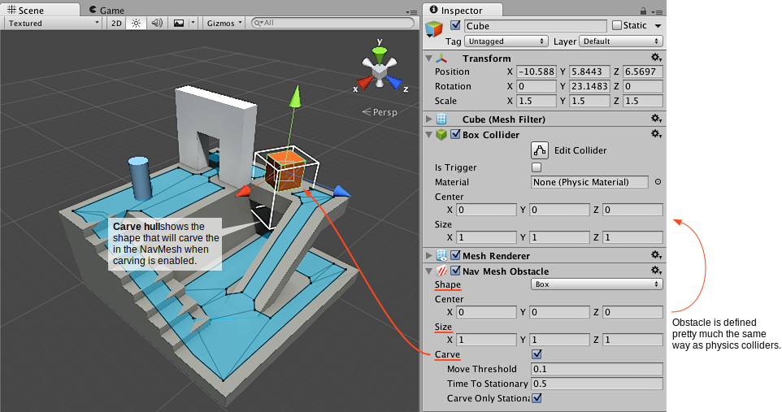

#创建导航网格障碍物

导航网格障碍物 (NavMesh Obstacle) 组件可用于描述代理在导航时应避开的障碍物。例如，代理应该在移动时避开物理控制的物体，例如板条箱和木桶。

我们将添加一个板条箱来阻挡该关卡顶部的通道。

 

1.首先创建一个**立方体**来表现板条箱：__Game Object &gt; 3D Object &gt; Cube__。
2.将立方体移动到平台顶部，立方体的默认大小很适合板条箱，因此请保持原样。
3.将一个**导航网格障碍物组件**添加到立方体。从 Inspector 中选择 **Add Component**，然后选择 **Navigation &gt; NavMesh Obstacle**。
4.将障碍物的形状设置为**盒体 (Box)**；更改形状将使中心和大小自动适应渲染网格。
5.将一个**刚体**添加到障碍物。从 Inspector 中选择 **Add Component**，然后选择 **Physics &gt; Rigid Body**。
6.最后从 NavMesh Obstacle Inspector 中开启 **Carve** 设置，以便代理了解如何在障碍物周围寻路。

现在我们有一个物理控制的有效板条箱，并且 AI 了解如何在导航时避开。

###阅读更多信息

- [导航系统的内部工作原理](nav-InnerWorkings.html) - 详细了解如何将障碍物用作导航的一部分。
- [导航网格障碍物组件参考](class-NavMeshObstacle.html) – 所有导航网格障碍物属性的完整描述。
- [导航网格障碍物脚本参考](../ScriptReference/AI.NavMeshObstacle.html) - 导航网格障碍物脚本 API 的完整描述。
