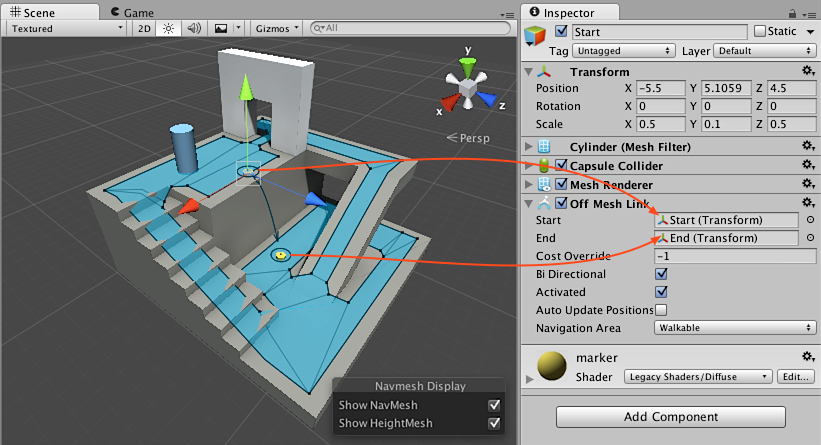

#创建网格外链接

网格外链接 (Off-Mesh Link) 用于创建穿过可步行导航网格表面外部的路径。例如，跳过沟渠或围栏，或在通过门之前打开门，全都可以描述为网格外链接。

我们将添加一个网格外链接组件来描述从上层平台到地面的跳跃。

 

1.首先创建**两个圆柱体**：__Game Object &gt; 3D Object &gt; Cylinder__。
2.可将圆柱体的比例设置为 _(0.1, 0.5, 0.1)_ 以便于使用它们。
3.将**第一个圆柱体**移动到上层平台的边缘，靠近导航网格表面。
4.将**第二个圆柱体**放在地面上，靠近导航网格，在链接应着陆的位置。
5.选择左侧的圆柱体，并为其添加网格外链接组件。从 Inspector 中选择 **Add Component**，然后选择 **Navigation &gt; Off Mesh Link**。
6.在 **Start** 字段中分配最左侧的圆柱体，并在 **End** 字段中分配最右侧的圆柱体。

现在设置好了能正常运行的网格外链接！如果通过网格外链接的路径短于沿导航网格行走的路径，则将使用网格外链接。

可使用场景中的任何游戏对象来容纳网格外链接组件，例如，围栏预制件可包含网格外链接组件。同样，可使用任何以变换作为开始和结束标记的游戏对象。

导航网格烘焙过程可以自动检测并创建常见的跳过和掉下链接。请参阅[自动构建网格外链接](nav-BuildingOffMeshLinksAutomatically.html)以了解更多详细信息。

###阅读更多信息

- [自动构建网格外链接](nav-BuildingOffMeshLinksAutomatically.html) - 了解如何自动构建网格外链接。
- [导航操作方法](nav-HowTos.html) - 导航网格代理的常见用例以及源代码。
- [网格外链接组件参考](class-OffMeshLink.html) – 所有网格外链接属性的完整描述。
- [网格外链接脚本参考](../ScriptReference/AI.OffMeshLink.html) - 网格外链接脚本 API 的完整描述。
