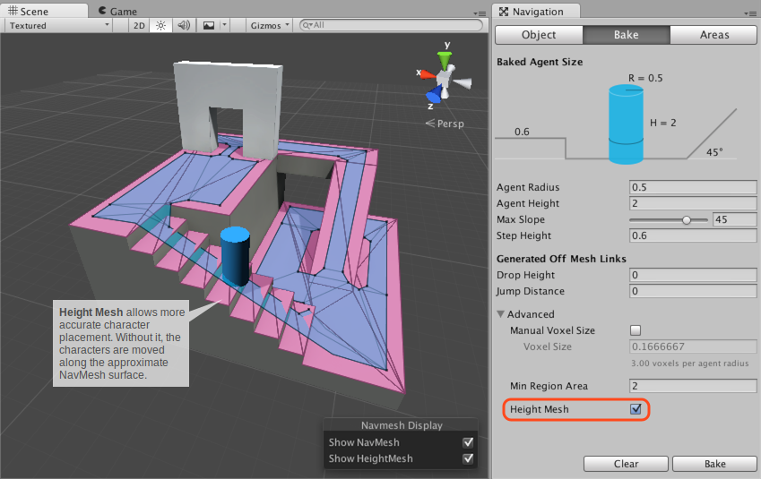

#构建高度网格以准确放置角色

高度网格 (Height Mesh) 可用于将角色更准确地放置在可行走表面上。

 

在导航时，导航网格代理 (NavMesh Agent) 被约束在导航网格的表面上。由于导航网格是可行走空间的近似形状，因此在构建导航网格时会使某些特征扁平化。例如，楼梯可能在导航网格中显示为斜坡。如果游戏需要准确放置代理，则应在烘焙导航网格时启用 _Height Mesh_ 构建。可在 Navigation 窗口的 Advanced 设置下找到该设置。请注意，构建高度网格将在运行时占用内存和处理资源，并需要稍微更长一点的时间来烘焙导航网格。

###阅读更多信息
- [构建导航网格](nav-BuildingNavMesh.html) – 关于导航网格烘焙的工作流程。
