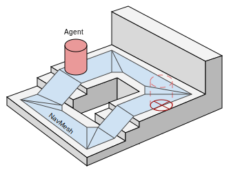
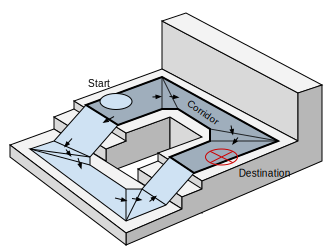
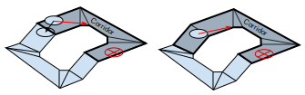
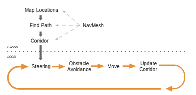
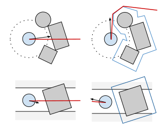
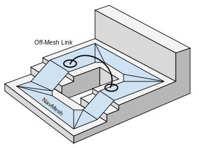

#导航系统的内部工作原理

当您希望智能地移动游戏中的角色（或者 AI 行业中所称的代理）时，必须解决两个问题：如何_推断_关卡来寻找目标，然后如何_移动_到该位置。这两个问题是紧密相关的，但性质却截然不同。关卡推断问题更具全局性和静态性，因为需要考虑整个场景。移动到目标更具局部性和动态性，只考虑移动的方向以及如何防止与其他移动的代理发生碰撞。

##可行走区域

 

导航系统需要自己的数据来表示游戏场景中的可行走区域。可行走区域定义了代理可在场景中站立和移动的位置。在 Unity 中，代理被描述为圆柱体。可行走区域是通过测试代理可站立的位置从场景中的几何体自动构建的。然后，这些位置连接到场景几何体之上覆盖的表面。该表面称为导航网格（简称 NavMesh）。

导航网格将该表面存储为凸多边形。凸多边形是一种有用的表示，因为我们知道多边形内的任意两点之间没有障碍物。除了多边形边界之外，我们还存储有关哪些多边形彼此相邻的信息。这使我们能够推断整个可行走区域。

##寻路
 
 

要寻找场景中两个位置之间的路径，我们首先需要将起始位置和目标位置映射到各自最近的多边形。然后，我们从起始位置开始搜索，访问所有邻居，直到我们到达目标多边形。通过跟踪被访问的多边形，我们可以找出从起点到目标的多边形序列。一种寻路的常用算法是 A*（发音为“A star”），这也是 Unity 使用的算法。

##跟随路径

 

描述从起点到目标多边形的路径的多边形序列称为“走廊”(corridor)。代理将始终朝着走廊的下一个可见拐角移动，直至到达目标。如果一个简单游戏只有一个代理在场景中移动，可一次性找出走廊的所有拐角，并推动角色沿着连接拐角的线段移动。

在多个代理同时移动的情况下，它们需要在避开彼此时偏离原始路径。试图使用由线段组成的路径来纠正这种偏差很快变得非常困难并且容易出错。

 

由于每一帧中的代理移动距离非常小，我们可以使用多边形的连接来修复走廊，以防我们需要稍微绕道而行。然后，我们快速找到下一个需要抵达的可见拐角。

##躲避障碍物

 

转向逻辑将采用下一个拐角的位置并基于该位置计算出到达目标所需的方向和速度。使用所需的速度移动代理可能会导致与其他代理发生碰撞。

障碍躲避系统将选择新的速度，该速度可平衡“代理在所需方向上移动”和“防止未来与其他代理及导航网格边缘发生碰撞”这两个问题。Unity 采用倒数速度障碍物 (RVO) 来预测和防止碰撞。

##移动代理

最后在转向和障碍躲避之后计算最终速度。在 Unity 中使用简单的动态模型来模拟代理，该模型还考虑了加速度以实现更自然和平滑的移动。

在此阶段，您可以将速度从模拟的代理提供给动画系统，从而使用根运动移动角色，或让导航系统处理该问题。

使用任一方法移动代理后，模拟代理位置将移动并约束到导航网格。最后这一小步对于实现强大的导航功能非常重要。

##全局和局部

 

关于导航需要了解的最重要事项之一是全局和局部导航之间的区别。

全局导航用于在整个世界中寻找走廊。在整个世界中寻路是一项代价高昂的操作，需要相当多的处理能力和内存。

描述路径的多边形的线性列表是用于转向的灵活数据结构，并可在代理的位置移动时进行局部调整。局部导航试图确定如何有效移动到下一个拐角而不与其他代理或移动对象发生碰撞。

##障碍物的两种情况

许多导航应用需要其他类型的障碍物而不仅仅是其他代理。这些障碍物可能是射击游戏中的常规板条箱和木桶，或者是车辆。可使用局部障碍躲避或全局寻路功能来应对障碍物。

当障碍物为移动状态时，最好使用局部障碍躲避功能进行处理。这样，代理可预测性地避开障碍物。当障碍物变为静止状态并可认为其阻挡了所有代理的路径时，障碍物应该影响全局导航，即导航网格。

更改导航网格称为“雕刻”(carving)。该过程将检测障碍物的哪些部分会接触导航网格并在导航网格中雕刻孔洞。此操作的计算成本十分高昂，因此这也是应该使用碰撞躲避功能来处理移动障碍物的另一个充分理由。

 

局部碰撞躲避功能也常用于绕过稀疏分散的障碍物。由于算法是局部的，因此它只考虑即将发生的碰撞，并且不能绕过陷阱或处理障碍物挡路的情况。这些情况可使用雕刻技术来解决。

##描述网格外链接

 

导航网格多边形之间的连接是使用寻路系统内的链接描述的。有时需要让代理在不可步行位置进行导航，例如，跳过围栏或穿过关闭的门。这些情况需要知道动作的位置。

可使用网格外链接来注释这些动作；此类链接会告诉寻路器 (pathfinder) 存在一条通过指定链接的路线。稍后在跟随路径时可访问此链接，并可执行特殊动作。
