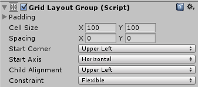

# 网格布局组 (Grid Layout Group)

网格布局组组件将其子布局元素放在网格中。

 

##属性

|**_属性：_** |**_功能：_** |
|:---|:---|
|__Padding__ |布局组边缘内的填充。 |
|__Cell Size__ |要用于组内每个布局元素的大小。 |
|__Spacing__ |布局元素之间的间距。 |
|__Start Corner__ |第一个元素所在的角。 |
|__Start Axis__ |沿哪个主轴放置元素。Horizontal 将在填充整行后才开始新行。Vertical 将在填充整列后才开始新列。 |
|__Child Alignment__ |用于布局元素的对齐方式（如果这些元素未填满可用空间）。 |
|__Constraint__ |将网格约束为固定数量的行或列以便支持自动布局系统。 |

##描述

与其他布局组不同，网格布局组会忽略其包含的布局元素的最小大小、偏好大小和灵活大小属性，而是为所有这些元素分配固定大小，此大小则由网格布局组本身的 Cell Size 属性进行定义。

###网格布局组和自动布局

将网格布局组用作自动布局设置的一部分（例如将其与[内容大小适配器 (Content Size Fitter)](script-ContentSizeFitter.html) 一起使用）时，需要注意一些特殊注意事项。

自动布局系统会独立计算水平和垂直大小。这一点可能与网格布局组不一致；网格布局组的行数取决于列数或反之。

对于任何给定数量的单元格，行数和列数的不同组合可以使网格适应其内容。为了支持布局系统，可使用 Constraint 属性指定希望该表具有固定列数或行数。

建议按照以下方法将布局系统与内容大小适配器结合使用：

####灵活宽度和固定高度

要设置具有灵活宽度和固定高度的网格，从而使网格随着添加的元素增多而水平扩展，可设置如下属性：

* Grid Layout Group Constraint：Fixed Row Count
* Content Size Fitter Horizontal Fit：Preferred Size
* Content Size Fitter Vertical Fit：Preferred Size 或 Unconstrained

如果 Vertical Fit 设置为 Unconstrained，则由您为网格提供足够大的高度来适应指定的单元格行数。

####固定宽度和灵活高度

要设置具有固定宽度和灵活高度的网格，从而使网格随着添加的元素增多而垂直扩展，可设置如下属性：

* Grid Layout Group Constraint：Fixed Column Count
* Content Size Fitter Horizontal Fit：Preferred Size 或 Unconstrained
* Content Size Fitter Vertical Fit：Preferred Size

如果 Horizontal Fit 设置为 Unconstrained，则由您为网格提供足够大的宽度来适应指定的单元格列数。

####灵活宽度和灵活高度

如果希望网格同时具有灵活宽度和灵活高度，这是可以的，但无法控制具体的行数和列数。网格将尝试使行数和列数大致相同。可设置如下属性：

* Grid Layout Group Constraint：Flexible
* Content Size Fitter Horizontal Fit：Preferred Size
* Content Size Fitter Vertical Fit：Preferred Size

