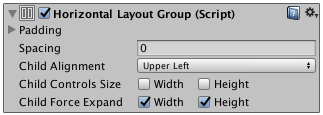

# 水平布局组 (Horizontal Layout Group)

##属性

 

|**_属性：_** |**_功能：_** |
|:---|:---|
|__Padding__ |布局组边缘内的填充。 |
|__Spacing__ |布局元素之间的间距。 |
|__Child Alignment__ |用于子布局元素的对齐方式（如果这些元素未填满可用空间）。 |
|__Child Controls Size__ |布局组是否控制其子项的宽度和高度。|
|__Child Force Expand__ |是否要强制子项扩展以填充额外的可用空间。 |

##描述

水平布局组组件将其子布局元素并排放置在一起。子布局元素的宽度根据以下规则由各自的最小宽度、偏好宽度和灵活宽度决定：

* 所有子布局元素的最小宽度相加，并加上它们之间的间距。得到的结果便是水平布局组的最小宽度。
* 所有子布局元素的偏好宽度相加，并加上它们之间的间距。得到的结果便是水平布局组的偏好宽度。
* 如果水平布局组处于其最小宽度或更小值，则所有子布局元素也将具有最小宽度。
* 水平布局组越接近其偏好宽度，每个子布局元素也越接近偏好宽度。
* 如果水平布局组宽度大于其偏好宽度，则会根据各子布局元素的灵活宽度按比例为子布局元素分配额外的可用空间。
