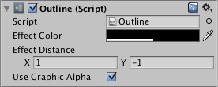

#轮廓 (Outline)

轮廓组件为图形组件（如文本或图像）添加简单的轮廓效果。必须与图形组件位于同一游戏对象上。

 

##属性

|**_属性：_** |**_功能：_** |
|:---|:---|
|__Effect Color__ | 轮廓的颜色。 |
|__Effect Distance__ | 轮廓效果在水平和垂直方向的距离。 |
|__Use Graphic Alpha__ | 将图形颜色叠加到效果颜色上。 |
