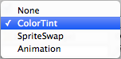
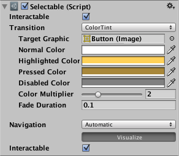
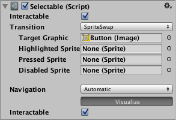

# 过渡选项

在可选组件中，有几个过渡选项，具体取决于可选组件的当前状态。不同的状态包括：正常、突出显示、按下和禁用。

 

|**_过渡选项：_** |**_功能：_** |
|:---|:---|
|__None__ | 此选项用于使按钮完全没有状态效果。|
|__Color Tint__ | 根据按钮所处的状态更改按钮的颜色。可为每个单独的状态选择颜色。还可在不同状态之间设置 Fade Duration 属性。数字越大，颜色之间的淡入淡出越慢。 |
|__Sprite Swap__ | 允许根据按钮当前的状态显示不同的精灵，并可自定义精灵。|
|__Animation__ | 允许根据按钮的状态产生动画，必须存在动画器组件才能使用动画过渡。确保禁用根运动非常重要。要创建动画控制器，请单击 Generate Animation（或自行创建），并确保已将动画控制器添加到按钮的动画器组件。|

每个过渡选项（None 除外）提供了用于控制过渡的附加选项。我们将在下面各个部分详细介绍这些选项。

##Color Tint

 

|**_属性：_** |**_功能：_** |
|:---|:---|
|__Target Graphic__ | 用于交互组件的图形。|
|__Normal Color__ |控件的正常颜色  |
|__Highlighted Color__ |控件突出显示时的颜色  |
|__Pressed Color__ |控件按下时的颜色  |
|__Disabled Color__ |控件禁用时的颜色  |
|__Color Multiplier__ | 这会将每个过渡的着色颜色乘以其值。由此可以创建大于 1 的颜色，从而使基色小于白色（或小于完整 Alpha）的图形元素上的颜色（或 Alpha 通道）变亮。 |
|__Fade Duration__ |从一个状态淡入淡出到另一个状态所需的时间（以秒为单位）  |

##Sprite Swap

 

|**_属性：_** |**_功能：_** |
|:---|:---|
|__Target Graphic__ | 要使用的正常精灵 |
|__Highlighted Sprite__ | 控件突出显示时要使用的精灵 |
|__Pressed Sprite__ | 控件按下时要使用的精灵 |
|__Disabled Sprite__ | 控件禁用时要使用的精灵 |

##Animation

 

|**_属性：_** |**_功能：_** |
|:---|:---|
|__Normal Trigger__ | 要使用的正常动画触发器 |
|__Highlighted Trigger__ | 控件突出显示时要使用的触发器 |
|__Pressed Trigger__ | 控件按下时要使用的触发器 |
|__Disabled Trigger__ | 控件禁用时要使用的触发器 |
