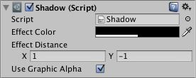

#阴影 (Shadow)

阴影组件为图形组件（如文本或图像）添加简单的轮廓效果。必须与图形组件位于同一游戏对象上。

 

##属性

|**_属性：_** |**_功能：_** |
|:---|:---|
|__Effect Color__ | 阴影的颜色。 |
|__Effect Distance__ | 阴影的偏移（表示为矢量）。 |
|__Use Graphic Alpha__ | 将图形颜色叠加到效果颜色上。 |
