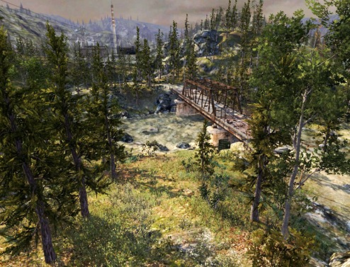

#地形引擎

 

Unity 的__地形 (Terrain)__ 系统允许您为游戏添加大型景观。在运行时，地形渲染在渲染效率方面进行了高度优化，而在 Editor 中，可使用一系列工具轻松快速地创建地形。本部分介绍地形可用的各种选项以及如何使用它们。

另请参阅知识库的[地形 (Terrain)](https://support.unity3d.com/hc/en-us/sections/201377903-Terrain) 部分。
