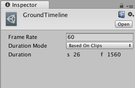

# 设置时间轴属性

使用 Inspector 窗口可设置所选时间轴资源的帧率、持续时间模式和固定长度。从 Project 窗口中，选择一个时间轴资源以查看其属性。

 

时间轴属性也可在 Timeline Editor 窗口的[时间轴设置](TimelineSettings.html)中找到。

|**属性：** |**功能：** |
|:---|:---|
|__Frame Rate__| 使用 Frame Rate 可设置时间轴资源的播放速度。时间轴资源的总体速度根据每秒帧数而加速或减速。每秒帧数越高，整个时间轴播放的速度就越快。 |
|__Duration Mode__ | 使用 Duration Mode 可设置时间轴资源的持续时间是基于时间轴中的剪辑还是固定长度。 |
|__Based On Clips__ | 选择 Based On Clips 可根据最后一个剪辑的结尾来设置时间轴资源的长度。Duration 属性以秒和帧为单位显示时间轴资源的长度。 |
|__Fixed Length__ | 选择 Fixed Length 可使用 Duration 属性将时间轴资源的长度设置为特定的秒数或帧数。 |
|__Duration__ | Duration 属性以秒和帧为单位显示时间轴资源的长度。仅当 Duration Mode 设置为 Fixed Length 时，才能编辑 Duration 属性。  |

---
* 2017-12-07  Page published with limited [editorial review](DocumentationEditorialReview.html)

