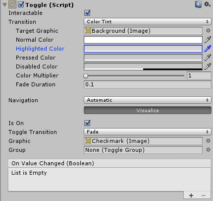

#开关 (Toggle)

__开关__控件是让用户打开或关闭某个选项的复选框。

 

##属性

|**_属性：_** |**_功能：_** |
|:---|:---|
|__Interactable__ | 此组件是否接受输入？请参阅 [Interactable](script-Selectable.html)。 |
|__Transition__ | 确定控件以何种方式对用户操作进行可视化响应的属性。请参阅[过渡选项](script-SelectableTransition.html)。 |
|__Navigation__ | 确定控件顺序的属性。请参阅[导航选项](script-SelectableNavigation.html)。|
|__Is On__ | 开关在开始时是否为打开状态？  |
|__Toggle Transition__ | 开关在其值发生变化时以图形方式作出的反应。提供的选项为 _None_（即复选标记直接出现或消失）和 _Fade_（即复选标记淡入或淡出）。 |
|__Graphic__ |用于复选标记的图像。 |
|__Group__ | 此开关所属的[开关组](script-ToggleGroup.html)（如果有）。 |

##事件

|**_属性：_** |**_功能：_** |
|:---|:---|
|__On Value Changed__ | 单击开关时调用的 [UnityEvent](UnityEvents.html)。该事件可将当前状态作为 `bool` 类型动态参数发送。 |

##详细信息

开关控件可让用户打开或关闭某个选项。如果一次只能打开一组选项中的一个选项，还可以将多个开关组合到一个[开关组](script-ToggleGroup.html)中。

开关有一个名为 _On Value Changed_ 的事件，当用户更改当前值时会响应。新值作为 `boolean` 参数传递给事件函数。开关的典型用例包括：

* 打开或关闭选项（例如，在游戏期间播放音乐）。
* 让用户确认他们已阅读法律免责声明。
* 以开关组形式使用时，选择一组选项中的一个选项（例如，一周中的某一天）。

请注意，__开关__是为子项提供可单击区域的父项。如果__开关__没有子项（或者子项被禁用），则不可单击开关。
