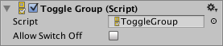

#开关组 (Toggle Group)

__开关组__不是可见的 UI 控件，而是一种修改一组[开关](script-Toggle.html)的行为的方法。属于同一组的开关将受到约束，即一次只能打开其中一个开关：通过按下打开其中一个开关便会自动关闭其他开关。

 

##属性

|**_属性：_** |**_功能：_** |
|:---|:---|
|__Allow Switch Off__ | 是否允许不打开任何开关？如果启用此设置，则按下当前打开的开关会将其关闭，因此没有任何开关处于打开状态。如果禁用此设置，则按下当前打开的开关将不改变该开关的状态。 |

##描述

通过将开关组对象拖动到组中每个开关的 _Group_ 属性即可设置开关组。

当用户必须从互斥的一组选项进行选择时，便可使用开关组。常见示例包括选择玩家角色类型、速度设置（慢速、中速、快速等）、预设颜色和一周中的日期。在场景中可以同时有多个开关组对象，因此可以根据需要创建多个单独的组。

与其他 UI 元素不同，具有开关组 (Toggle Group) 组件的对象不必是[画布](class-Canvas.html)对象的子项，但开关本身仍然是其子项。

请注意，如果在加载场景或实例化组时，开关组中的多个开关为打开状态，则开关组不会立即执行其约束。只有当新开关打开时，其他开关才会关闭。这意味着需要由您确保在开始时只打开一个开关。
