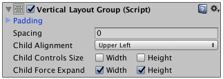

# 垂直布局组 (Vertical Layout Group)

##属性

 

|**_属性：_** |**_功能：_** |
|:---|:---|
|__Padding__ |布局组边缘内的填充。 |
|__Spacing__ |布局元素之间的间距。 |
|__Child Alignment__ |用于子布局元素的对齐方式（如果这些元素未填满可用空间）。 |
|__Child Controls Size__ |布局组是否控制其子项的宽度和高度。|
|__Child Force Expand__ |是否要强制子项扩展以填充额外的可用空间。 |

##描述

垂直布局组组件将子布局元素纵向放置。子布局元素的高度根据以下规则由各自的最小高度、偏好高度和灵活高度决定：

* 所有子布局元素的最小高度相加，并加上它们之间的间距。得到的结果便是垂直布局组的最小高度。
* 所有子布局元素的偏好高度相加，并加上它们之间的间距。得到的结果便是垂直布局组的偏好高度。
* 如果垂直布局组处于其最小高度或更小值，则所有子布局元素也将具有最小高度。
* 垂直布局组越接近其偏好高度，每个子布局元素也越接近偏好高度。
* 如果垂直布局组高度大于其偏好高度，则会根据各子布局元素的灵活高度按比例为子布局元素分配额外的可用空间。
