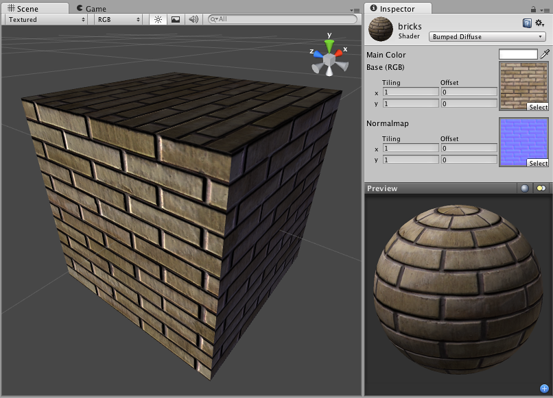

凹凸漫射 (Bumped Diffuse)
==============

**注意：**Unity 5 引入了[标准着色器](shader-StandardShader.html)来取代此着色器。

 

Normal Mapped Properties
------------------------

Like a __Diffuse__ shader, this computes a simple (Lambertian) lighting model. The lighting on the surface decreases as the angle between it and the light decreases. The lighting depends only on the angle, and does not change as the camera moves or rotates around.

__Normal mapping__ simulates small surface details using a texture, instead of spending more polygons to actually carve out details. It does not actually change the shape of the object, but uses a special texture called a __Normal Map__ to achieve this effect. In the normal map, each pixel's color value represents the angle of the surface normal. Then by using this value instead of the one from geometry, lighting is computed. The normal map effectively overrides the mesh's geometry when calculating lighting of the object.

###Creating Normal maps

You can import normal maps created outside of Unity, or you can import a regular grayscale image and convert it to a Normal Map from within Unity. (This page refers to a legacy shader which has been superseded by the [Standard Shader](shader-StandardShader.html), but you can learn more about how to use [Normal Maps in the Standard Shader](StandardShaderMaterialParameterNormalMap.html))

###Technical Details

The Normal Map is a tangent space type of normal map. Tangent space is the space that "follows the surface" of the model geometry. In this space, Z always points away from the surface. Tangent space Normal Maps are a bit more expensive than the other "object space" type Normal Maps, but have some advantages:

1. It's possible to use them on deforming models - the bumps will remain on the deforming surface and will just work.
1. It's possible to reuse parts of the normal map on different areas of a model; or use them on different models.
 

Diffuse Properties
------------------

Diffuse computes a simple (Lambertian) lighting model. The lighting on the surface decreases as the angle between it and the light decreases. The lighting depends only on this angle, and does not change as the camera moves or rotates around.
 

性能
-----------

通常，此着色器的渲染成本低。有关更多详细信息，请查看[着色器性能页面](shader-Performance.html)。
