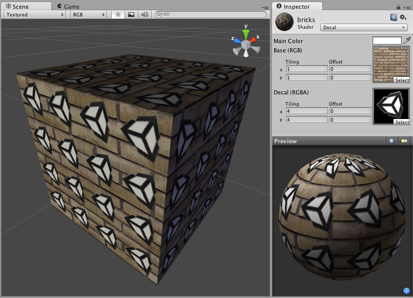

贴花 (Decal)
=====

**注意：**Unity 5 引入了[标准着色器](shader-StandardShader.html)来取代此着色器。

 

贴花属性
----------------

此着色器是 VertexLit 着色器的变体。所有照射的光照都将被此着色器渲染为顶点光照。除了主纹理之外，此着色器还使用第二个纹理来获取更多细节。第二个“贴花”纹理使用 Alpha 通道来确定主纹理的可见区域。贴花纹理应作为主纹理的补充。例如，如果有一面砖墙，则可将砖纹理平铺为主纹理，然后使用带有 Alpha 通道的贴花纹理在墙上的不同位置绘制涂鸦。

性能
-----------

此着色器大致相当于 VertexLit 着色器。由于使用第二个贴花纹理，此着色器的成本略高，但不会产生明显的影响。
