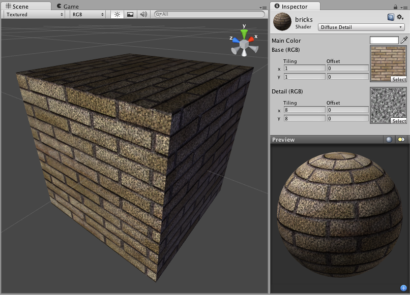

漫射细节 (Diffuse Detail)
==============

**注意：**Unity 5 引入了[标准着色器](shader-StandardShader.html)来取代此着色器。

 

漫射细节属性
-------------------------

此着色器是带有额外数据的常规漫射着色器的版本。此着色器允许您定义第二个“细节”纹理，当摄像机靠近时，该纹理将逐渐显示。此着色器可用于地形等之上。您可以使用一个基础低分辨率纹理，并将其拉伸到整个地形上。当摄像机靠近时，低分辨率纹理会变得模糊，但我们不希望出现这样的情况。为避免此效果，请创建一个将在地形上平铺的通用细节纹理。这样，当摄像机靠近时，便会显示额外的细节并避免模糊效果。

细节纹理放在基础纹理“之上”。细节纹理中较深的颜色会使主纹理变暗，而较浅的颜色会使其变亮。细节纹理通常呈灰色。

性能
-----------

此着色器采用像素光照，大致相当于漫射着色器。由于采用额外的纹理，因此成本略高。
