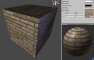
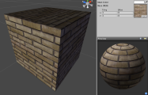
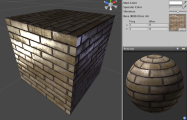
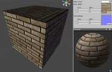
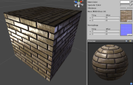
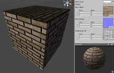
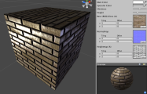
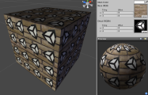
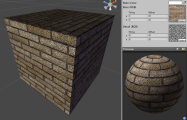

普通着色器系列
====================

**注意：**Unity 5 引入了[标准着色器](shader-StandardShader.html)来取代这些着色器。

这些着色器是 Unity 中的基本着色器。它们不是专门的着色器，应该适用于大多数不透明对象。如果想让对象透明、发光等，这些着色器不适合。

[顶点光照 (Vertex Lit)](shader-NormalVertexLit.html)
------------------------------------

**需要的资源：**

* 一个__基础__纹理，无需 Alpha 通道

[漫射 (Diffuse)](shader-NormalDiffuse.html)
-------------------------------

**需要的资源：**

* 一个__基础__纹理，无需 Alpha 通道

[镜面反射 (Specular)](shader-NormalSpecular.html)
---------------------------------

**需要的资源：**

* 一个__基础__纹理以及用于镜面贴图的 Alpha 通道

[法线贴图 (Normal mapped)](shader-NormalBumpedDiffuse.html)
-------------------------------------------

**需要的资源：**

* 一个__基础__纹理，无需 Alpha 通道
* 一个__法线贴图__

[法线贴图镜面反射 (Normal mapped Specular)](shader-NormalBumpedSpecular.html)
-----------------------------------------------------

**需要的资源：**

* 一个__基础__纹理以及用于镜面贴图的 Alpha 通道
* 一个__法线贴图__

[视差 (Parallax)](shader-NormalParallaxDiffuse.html)
----------------------------------------

**需要的资源：**

* 一个__基础__纹理，无需 Alpha 通道
* 一个__法线贴图__
* 一个__高度__纹理以及 Alpha 通道中的视差深度

[视差镜面反射 (Parallax Specular)](shader-NormalParallaxSpecular.html)
--------------------------------------------------

**需要的资源：**

* 一个__基础__纹理以及用于镜面贴图的 Alpha 通道
* 一个__法线贴图__
* 一个__高度__纹理以及 Alpha 通道中的视差深度

[贴花 (Decal)](shader-NormalDecal.html)
---------------------------

**需要的资源：**

* 一个__基础__纹理，无需 Alpha 通道
* 一个__贴花__纹理以及用于贴花透明度的 Alpha 通道

[漫射细节 (Diffuse Detail)](shader-NormalDiffuseDetail.html)
--------------------------------------------

**需要的资源：**

* 一个__基础__纹理，无需 Alpha 通道
* 一个__细节__灰度纹理；以 50% 灰色为中性色
