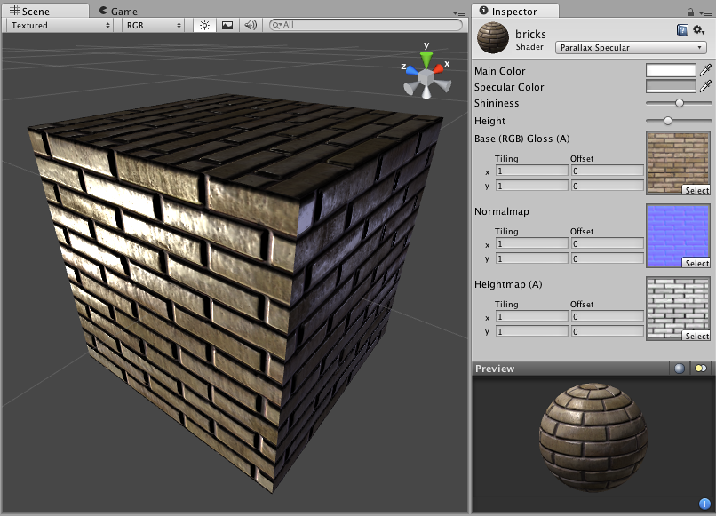

视差凹凸镜面反射 (Parallax Bumped Specular)
========================

**注意：**Unity 5 引入了[标准着色器](shader-StandardShader.html)来取代此着色器。

 

Parallax Normal mapped Properties
---------------------------------

__Parallax Normal mapped__ is the same as regular __Normal mapped__, but with a better simulation of "depth". The extra depth effect is achieved through the use of a __Height Map__. The Height Map is contained in the alpha channel of the Normal map. In the alpha, black is zero depth and white is full depth. This is most often used in bricks/stones to better display the cracks between them.

The Parallax mapping technique is pretty simple, so it can have artifacts and unusual effects. Specifically, very steep height transitions in the Height Map should be avoided. Adjusting the __Height__ value in the __Inspector__ can also cause the object to become distorted in an odd, unrealistic way. For this reason, it is recommended that you use gradual Height Map transitions or keep the __Height__ slider toward the shallow end.
 

Specular Properties
-------------------

Specular computes the same simple (Lambertian) lighting as Diffuse, plus a viewer dependent specular highlight. This is called the Blinn-Phong lighting model. It has a specular highlight that is dependent on surface angle, light angle, and viewing angle. The highlight is actually just a realtime-suitable way to simulate blurred reflection of the light source. The level of blur for the highlight is controlled with the __Shininess__ slider in the __Inspector__.

Additionally, the alpha channel of the main texture acts as a Specular Map (sometimes called "gloss map"), defining which areas of the object are more reflective than others. Black areas of the alpha will be zero specular reflection, while white areas will be full specular reflection. This is very useful when you want different areas of your object to reflect different levels of specularity. For example, something like rusty metal would use low specularity, while polished metal would use high specularity. Lipstick has higher specularity than skin, and skin has higher specularity than cotton clothes. A well-made Specular Map can make a huge difference in impressing the player.
 

性能
-----------

通常，此着色器的渲染成本较高。有关更多详细信息，请查看[着色器性能页面](shader-Performance.html)。
