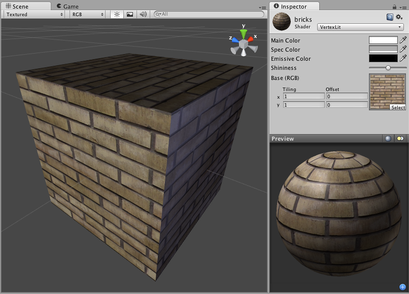

顶点光照 (Vertex-Lit)
==========

**注意：**Unity 5 引入了[标准着色器](shader-StandardShader.html)来取代此着色器。

 

Vertex-Lit Properties
---------------------

**注意：**Unity 5 引入了[标准着色器](shader-StandardShader.html)来取代此着色器。

This shader is __Vertex-Lit__, which is one of the simplest shaders. All lights shining on it are rendered in a single pass and calculated at vertices only.

Because it is vertex-lit, it won't display any pixel-based rendering effects, such as light cookies, normal mapping, or shadows. This shader is also much more sensitive to tesselation of the models. If you put a point light very close to a cube using this shader, the light will only be calculated at the corners. Pixel-lit shaders are much more effective at creating a nice round highlight, independent of tesselation. If that's an effect you want, you may consider using a pixel-lit shader or increase tesselation of the objects instead.
 

性能
-----------

通常，此着色器的渲染成本很低。有关更多详细信息，请查看[着色器性能页面](shader-Performance.html)。
