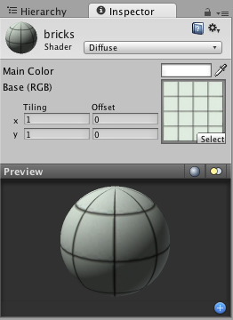

#内置着色器的用途和性能

Unity 中的着色器是通过__材质__来使用的，材质本质上结合了着色器代码与纹理等参数。[此处](Materials.html)提供了关于着色器/材质关系的深入说明。

当选择材质本身或选择一个使用材质的__游戏对象__时，材质属性将显示在 __Inspector__ 中。材质检视面板 (Inspector) 如下所示：

 

每种材质在 Inspector 中看起来会有所不同，具体取决于其使用的具体着色器。着色器本身决定了可在 Inspector 中调整的属性类型。有关材质检视面板的详细说明，请参阅[材质参考页面](class-Material.html)。请记住，着色器是通过材质实现的。因此，着色器定义将要在 Inspector 中显示的属性时，每种材质实际上包含来自滑动条、颜色和纹理的调整数据。在这方面要记住的最重要的一点是，可在多个材质中使用单个着色器，但单个材质不能使用多个着色器。

##性能注意事项

有许多因素会影响游戏的整体性能。本页面将专门讨论[内置着色器](Built-inShaderGuide.html)的性能注意事项。着色器的性能主要取决于两个方面：着色器本身以及项目或特定摄像机使用的[渲染路径](RenderingPaths.html)。有关编写您自己的着色器时的性能提示，请参阅 [ShaderLab 着色器性能](SL-ShaderPerformance.html)页面。

###渲染路径和着色器性能

在 Unity 支持的渲染路径中，[延迟着色](RenderTech-DeferredShading.html)和[顶点光照](RenderTech-VertexLit.html)路径具有最可预测的性能。在延迟着色中，每个对象通常被绘制一次（无论哪些光源影响它）。同样，在顶点光照中，每个对象通常被绘制一次。因此，着色器的性能差异主要取决于它们使用的纹理数量以及它们执行的计算。

###前向渲染路径中的着色器性能

在[前向](RenderTech-ForwardRendering.html)渲染路径中，着色器的性能取决于着色器本身和场景光照这**两种**因素。以下部分将进行详细介绍。从性能角度看，有两种基本的着色器类别：__顶点光照 (Vertex-Lit)__ 和__像素光照 (Pixel-Lit)__。

前向渲染路径中的__顶点光照__着色器总是比像素光照着色器的成本更低。这些着色器同时使用所有光源基于网格顶点来计算光照。因此，无论在对象上有多少光照，都只需要绘制一次。

__像素光照__着色器计算绘制的每个像素的最终光照。因此，必须绘制一次对象以获取环境和主方向光，并针对每次额外光照绘制一次对象。因此，方案为 N 个渲染 pass，其中 N 表示照射在对象上的最终像素光照数。这种方案增加了 CPU 处理和发送命令到显卡以及在显卡上处理顶点并绘制像素的工作负载。像素光照对象在屏幕上的大小也会影响绘制该对象的速度。对象越大，绘制得越慢。

所以，像素光照着色器会带来性能成本，但这样的成本可产生一些出色的效果：阴影、法线贴图、漂亮的镜面高光和光照剪影，不一而足。

请记住，可强制光照进入像素（“重要”）或顶点/SH（“非重要”）模式。在像素光照着色器上照射的任何顶点光照都将基于对象的顶点或整个对象进行计算，并且不会计入与像素光照关联的渲染成本或视觉效果。

##一般着色器性能

[内置着色器](Built-inShaderGuide.html)的复杂程度从低到高的顺序大致如下：

* __无光照 (Unlit)__。这只是一种纹理，不受任何光照的影响。
*__顶点光照 (VertexLit)__。
* __漫射 (Diffuse)__。
* __法线贴图 (Normal mapped)__。此项比漫射的成本略高：增加了一个纹理（法线贴图）和一些着色器指令。
* __镜面反射 (Specular)__。此项增加了镜面高光计算。
* __法线贴图镜面反射 (Normal Mapped Specular)__。同样，此项比镜面反射的成本略高。
* __视差法线映射 (Parallax Normal mapped)__。此项增加了视差法线贴图计算。
* __视差法线贴图镜面反射 (Parallax Normal Mapped Specular)__。此项增加了视差法线贴图计算和镜面高光计算。

## 移动端简化着色器

此外，Unity 还有几个针对移动平台的简化着色器，位于“Mobile”类别下。这些着色器也适用于其他平台，因此如果能容忍使用它们经过简化这一事实（例如近似镜面反射、无每种材质的颜色支持等），可尝试使用它们！

要查看每个着色器已进行的具体简化情况，请查看“内置着色器”包中的 `.shader` 文件，此文件顶端的一些注释中列出了相关信息。

移动端着色器中常见的一些更改示例如下：

* 着色器没有用于着色的材质颜色或主色。
* 对于采用法线贴图的着色器，使用了基础纹理的平铺和偏移。
* 粒子着色器不支持 `AlphaTest` 或 `ColorMask`。
* 有限的功能和光照支持，例如，一些着色器仅支持一个方向光。
