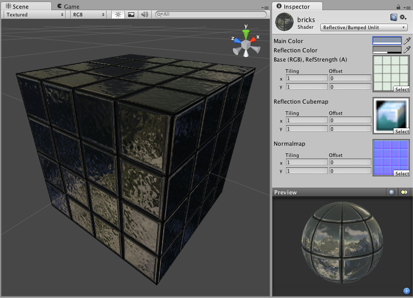

反光法线贴图无光照 (Reflective Normal Mapped Unlit)
==============================

**注意：**Unity 5 引入了[标准着色器](shader-StandardShader.html)来取代此着色器。

 

Reflective Properties
---------------------

**注意：**Unity 5 引入了[标准着色器](shader-StandardShader.html)来取代此着色器。

This shader will simulate reflective surfaces such as cars, metal objects etc. It requires an environment Cubemap which will define what exactly is reflected. The main texture's alpha channel defines the strength of reflection on the object's surface. Any scene lights will add illumination on top of what is reflected.
 

法线贴图属性
------------------------

此着色器不以传统方式使用法线贴图。法线贴图不会影响对象上的任何光照，因为此着色器根本不使用光照。法线贴图只会扭曲反射贴图。

特殊属性
------------------

此着色器很特别，因为它根本不响应光照，所以您不必担心使用多个光照会降低性能的问题。此着色器只是在模型上显示反射立方体贴图。法线贴图会扭曲反射，因此可获得高度细节化的反射。因为不响应光照，所以其成本非常低。此着色器在一定程度上属于专用类别，但在此类情况下，能够以尽可能低的成本满足您的需求。

性能
-----------

通常，此着色器的渲染成本非常低。有关更多详细信息，请查看[着色器性能页面](shader-Performance.html)。
