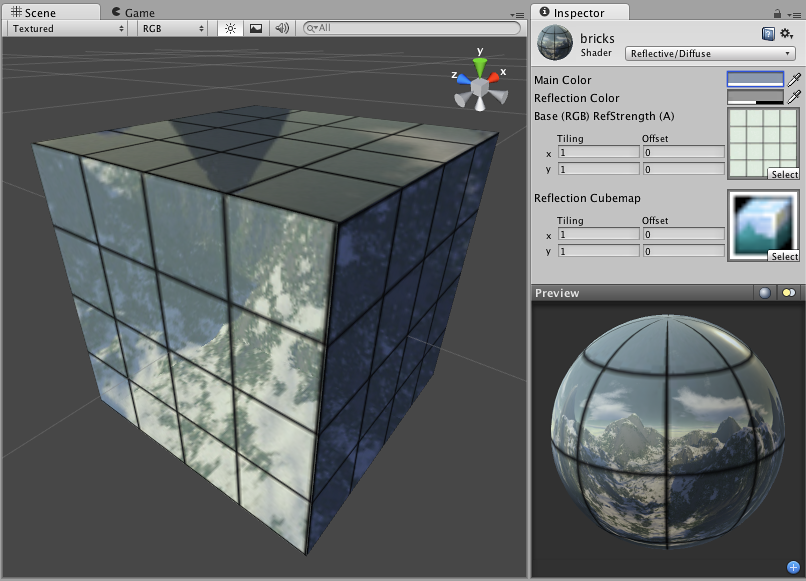

反光漫射 (Reflective Diffuse)
==================

**注意：**Unity 5 引入了[标准着色器](shader-StandardShader.html)来取代此着色器。

 

Reflective Properties
---------------------

**注意：**Unity 5 引入了[标准着色器](shader-StandardShader.html)来取代此着色器。

This shader will simulate reflective surfaces such as cars, metal objects etc. It requires an environment Cubemap which will define what exactly is reflected. The main texture's alpha channel defines the strength of reflection on the object's surface. Any scene lights will add illumination on top of what is reflected.
 

Diffuse Properties
------------------

Diffuse computes a simple (Lambertian) lighting model. The lighting on the surface decreases as the angle between it and the light decreases. The lighting depends only on this angle, and does not change as the camera moves or rotates around.
 

性能
-----------

通常，此着色器的渲染成本低。有关更多详细信息，请查看[着色器性能页面](shader-Performance.html)。
