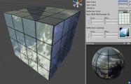
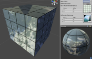
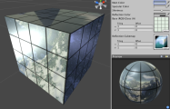
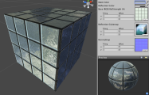
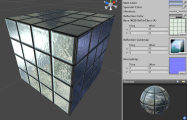
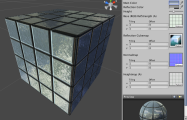
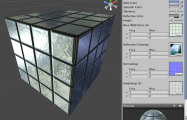
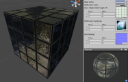
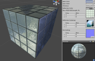

反光着色器系列
========================

**注意：**Unity 5 引入了[标准着色器](shader-StandardShader.html)来取代这些着色器。

__反光 (Reflective)__ 着色器将允许您使用将会在网格上反射的立方体贴图。您还可以通过__基础__纹理的 Alpha 通道定义对象上反射率或高或低的区域。高反射率对于表现光泽、油、铬等具有很好的效果。低反射率可增加金属、液体表面或视频监视器的效果。

[反光顶点光照 (Reflective Vertex-Lit)](shader-ReflectiveVertexLit.html)
---------------------------------------------------

**需要的资源：**

* 一个__基础__纹理以及用于定义反射区域的 Alpha 通道
* 一个用于反射贴图的__反射__立方体贴图

[&amp;#187; 更多详细信息](shader-ReflectiveVertexLit.html)

[反光漫射 (Reflective Diffuse)](shader-ReflectiveDiffuse.html)
----------------------------------------------

**需要的资源：**

* 一个__基础__纹理以及用于定义反射区域的 Alpha 通道
* 一个用于反射贴图的__反射__立方体贴图

[&amp;#187; 更多详细信息](shader-ReflectiveDiffuse.html)

[反光镜面反射 (Reflective Specular)](shader-ReflectiveSpecular.html)
------------------------------------------------

**需要的资源：**

* 一个__基础__纹理以及同时用于定义反射区域和镜面贴图的 Alpha 通道
* 一个用于反射贴图的__反射__立方体贴图

**注意：**
此着色器的一个注意事项是__基础__纹理的 Alpha 通道将同时兼作反射区域和镜面贴图。

[&amp;#187; 更多详细信息](shader-ReflectiveSpecular.html)

[反光法线贴图 (Reflective Normal mapped)](shader-ReflectiveBumpedDiffuse.html)
----------------------------------------------------------

**需要的资源：**

* 一个__基础__纹理以及用于定义反射区域的 Alpha 通道
* 一个用于反射贴图的__反射__立方体贴图
* 一个__法线贴图__，无需 Alpha 通道

[&amp;#187; 更多详细信息](shader-ReflectiveBumpedDiffuse.html)

[反光法线贴图镜面反射 (Reflective Normal Mapped Specular)](shader-ReflectiveBumpedSpecular.html)
--------------------------------------------------------------------

**需要的资源：**

* 一个__基础__纹理以及同时用于定义反射区域和镜面贴图的 Alpha 通道
* 一个用于反射贴图的__反射__立方体贴图
* 一个__法线贴图__，无需 Alpha 通道

**注意：**
此着色器的一个注意事项是__基础__纹理的 Alpha 通道将同时兼作反射区域和镜面贴图。

[&amp;#187; 更多详细信息](shader-ReflectiveBumpedSpecular.html)

[反光视差 (Reflective Parallax)](shader-ReflectiveParallaxDiffuse.html)
-------------------------------------------------------

**需要的资源：**

* 一个__基础__纹理以及用于定义反射区域的 Alpha 通道
* 一个用于反射贴图的__反射__立方体贴图
* 一个__法线贴图__以及用于视差深度的 Alpha 通道

[&amp;#187; 更多详细信息](shader-ReflectiveParallaxDiffuse.html)

[反光视差镜面反射 (Reflective Parallax Specular)](shader-ReflectiveParallaxSpecular.html)
-----------------------------------------------------------------

**需要的资源：**

* 一个__基础__纹理以及用于定义反射区域和镜面贴图的 Alpha 通道
* 一个用于反射贴图的__反射__立方体贴图
* 一个__法线贴图__以及用于视差深度的 Alpha 通道

**注意：**
此着色器的一个注意事项是__基础__纹理的 Alpha 通道将同时兼作反射区域和镜面贴图。

[&amp;#187; 更多详细信息](shader-ReflectiveParallaxSpecular.html)

[反光法线贴图无光照 (Reflective Normal mapped Unlit)](shader-ReflectiveBumpedUnlit.html)
--------------------------------------------------------------

**需要的资源：**

* 一个__基础__纹理以及用于定义反射区域的 Alpha 通道
* 一个用于反射贴图的__反射__立方体贴图
* 一个__法线贴图__，无需 Alpha 通道

[&amp;#187; 更多详细信息](shader-ReflectiveBumpedUnlit.html)

[反光法线贴图顶点光照 (Reflective Normal mapped Vertex-Lit)](shader-ReflectiveBumpedVertexLit.html)
-----------------------------------------------------------------------

**需要的资源：**

* 一个__基础__纹理以及用于定义反射区域的 Alpha 通道
* 一个用于反射贴图的__反射__立方体贴图
* 一个__法线贴图__，无需 Alpha 通道

[&amp;#187; 更多详细信息](shader-ReflectiveBumpedVertexLit.html)
