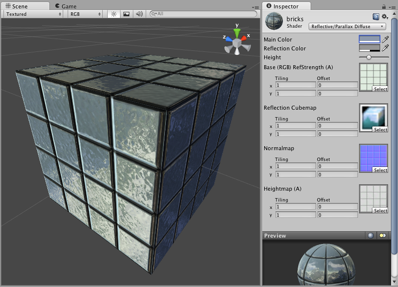

反光视差漫射 (Reflective Parallax Diffuse)
===========================

**注意：**Unity 5 引入了[标准着色器](shader-StandardShader.html)来取代此着色器。

 

Reflective Properties
---------------------

**注意：**Unity 5 引入了[标准着色器](shader-StandardShader.html)来取代此着色器。

This shader will simulate reflective surfaces such as cars, metal objects etc. It requires an environment Cubemap which will define what exactly is reflected. The main texture's alpha channel defines the strength of reflection on the object's surface. Any scene lights will add illumination on top of what is reflected.
 

Parallax Normal mapped Properties
---------------------------------

__Parallax Normal mapped__ is the same as regular __Normal mapped__, but with a better simulation of "depth". The extra depth effect is achieved through the use of a __Height Map__. The Height Map is contained in the alpha channel of the Normal map. In the alpha, black is zero depth and white is full depth. This is most often used in bricks/stones to better display the cracks between them.

The Parallax mapping technique is pretty simple, so it can have artifacts and unusual effects. Specifically, very steep height transitions in the Height Map should be avoided. Adjusting the __Height__ value in the __Inspector__ can also cause the object to become distorted in an odd, unrealistic way. For this reason, it is recommended that you use gradual Height Map transitions or keep the __Height__ slider toward the shallow end.
 

Diffuse Properties
------------------

Diffuse computes a simple (Lambertian) lighting model. The lighting on the surface decreases as the angle between it and the light decreases. The lighting depends only on this angle, and does not change as the camera moves or rotates around.
 

性能
-----------

通常，此着色器的渲染成本较高。有关更多详细信息，请查看[着色器性能页面](shader-Performance.html)。
