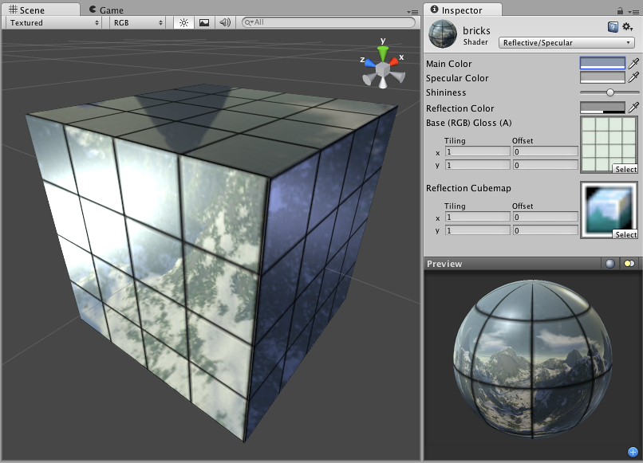

反光镜面反射 (Reflective Specular)
===================

**注意：**Unity 5 引入了[标准着色器](shader-StandardShader.html)来取代此着色器。

 

此着色器的一个注意事项是基础纹理的 Alpha 通道将同时兼作反射贴图 (Reflection Map) 和镜面贴图 (Specular Map)。

Reflective Properties
---------------------

**注意：**Unity 5 引入了[标准着色器](shader-StandardShader.html)来取代此着色器。

This shader will simulate reflective surfaces such as cars, metal objects etc. It requires an environment Cubemap which will define what exactly is reflected. The main texture's alpha channel defines the strength of reflection on the object's surface. Any scene lights will add illumination on top of what is reflected.
 

Specular Properties
-------------------

Specular computes the same simple (Lambertian) lighting as Diffuse, plus a viewer dependent specular highlight. This is called the Blinn-Phong lighting model. It has a specular highlight that is dependent on surface angle, light angle, and viewing angle. The highlight is actually just a realtime-suitable way to simulate blurred reflection of the light source. The level of blur for the highlight is controlled with the __Shininess__ slider in the __Inspector__.

Additionally, the alpha channel of the main texture acts as a Specular Map (sometimes called "gloss map"), defining which areas of the object are more reflective than others. Black areas of the alpha will be zero specular reflection, while white areas will be full specular reflection. This is very useful when you want different areas of your object to reflect different levels of specularity. For example, something like rusty metal would use low specularity, while polished metal would use high specularity. Lipstick has higher specularity than skin, and skin has higher specularity than cotton clothes. A well-made Specular Map can make a huge difference in impressing the player.
 

性能
-----------

通常，此着色器的渲染成本属于中等。有关更多详细信息，请查看[着色器性能页面](shader-Performance.html)。
