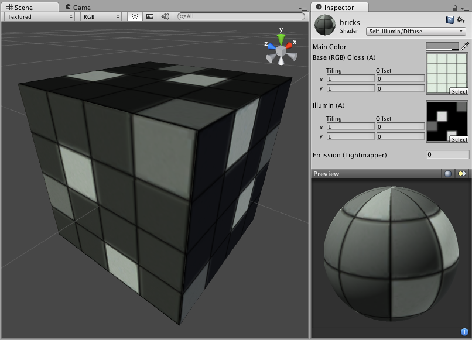

自发光漫射 (Self-Illuminated Diffuse)
========================

**注意：**Unity 5 引入了[标准着色器](shader-StandardShader.html)来取代此着色器。

 

Self-Illuminated Properties
---------------------------

**注意：**Unity 5 引入了[标准着色器](shader-StandardShader.html)来取代此着色器。

This shader allows you to define bright and dark parts of the object. The alpha channel of a secondary texture will define areas of the object that "emit" light by themselves, even when no light is shining on it. In the alpha channel, black is zero light, and white is full light emitted by the object. Any scene lights will add illumination on top of the shader's illumination. So even if your object does not emit any light by itself, it will still be lit by lights in your scene.
 

Diffuse Properties
------------------

Diffuse computes a simple (Lambertian) lighting model. The lighting on the surface decreases as the angle between it and the light decreases. The lighting depends only on this angle, and does not change as the camera moves or rotates around.
 

性能
-----------

通常，此着色器的渲染成本低。有关更多详细信息，请查看[着色器性能页面](shader-Performance.html)。
