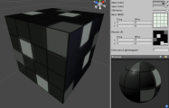
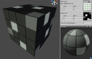
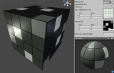
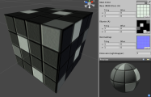
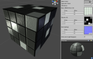
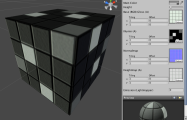
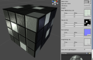

自发光着色器系列
==============================

**注意：**Unity 5 引入了[标准着色器](shader-StandardShader.html)来取代这些着色器。

__自发光 (Self-Illuminated)__ 着色器将根据附加的 Alpha 通道仅向自身发光。它们不需要任何外部光照即可自己发出这种光。任何顶点光照或像素光照都会在自发光的基础上进一步增加光照。

此类着色器主要用于发光对象。例如，墙壁纹理的某些部分可自发光以模拟光源或显示屏。这种着色器也可用于照亮在整个游戏过程中应始终具有一致光照的能量块对象（无论是否有光照）。

[自发光顶点光照 (Self-Illuminated Vertex-Lit)](shader-SelfIllumVertexLit.html)
--------------------------------------------------------

**需要的资源：**

* 一个__基础__纹理，无需 Alpha 通道
* 一个__光照__纹理以及用于光照贴图的 Alpha 通道

[&amp;#187; 更多详细信息](shader-SelfIllumVertexLit.html)

[自发光漫射 (Self-Illuminated Diffuse)](shader-SelfIllumDiffuse.html)
---------------------------------------------------

**需要的资源：**

* 一个__基础__纹理，无需 Alpha 通道
* 一个__光照__纹理以及用于光照贴图的 Alpha 通道

[&amp;#187; 更多详细信息](shader-SelfIllumDiffuse.html)

[自发光镜面反射 (Self-Illuminated Specular)](shader-SelfIllumSpecular.html)
-----------------------------------------------------

**需要的资源：**

* 一个__基础__纹理以及用于镜面贴图的 Alpha 通道
* 一个__光照__纹理以及用于光照贴图的 Alpha 通道

[&amp;#187; 更多详细信息](shader-SelfIllumSpecular.html)

[自发光凹凸 (Self-Illuminated Bumped)](shader-SelfIllumBumpedDiffuse.html)
--------------------------------------------------------

**需要的资源：**

* 一个__基础__纹理，无需 Alpha 通道
* 一个__法线贴图__以及用于光照的 Alpha 通道

[&amp;#187; 更多详细信息](shader-SelfIllumBumpedDiffuse.html)

[自发光凹凸镜面反射 (Self-Illuminated Bumped Specular)](shader-SelfIllumBumpedSpecular.html)
------------------------------------------------------------------

**需要的资源：**

* 一个__基础__纹理以及用于镜面贴图的 Alpha 通道
* 一个__法线贴图__以及用于光照贴图的 Alpha 通道

[&amp;#187; 更多详细信息](shader-SelfIllumBumpedSpecular.html)

[自发光视差 (Self-Illuminated Parallax)](shader-SelfIllumParallaxDiffuse.html)
------------------------------------------------------------

**需要的资源：**

* 一个__基础__纹理，无需 Alpha 通道
* 一个__法线贴图__以及同时用于光照贴图和视差深度的 Alpha 通道

**注意：**
此着色器的一个注意事项是__凹凸贴图__纹理的 Alpha 通道将同时兼作光照和视差深度。

[&amp;#187; 更多详细信息](shader-SelfIllumParallaxDiffuse.html)

[自发光视差镜面反射 (Self-Illuminated Parallax Specular)](shader-SelfIllumParallaxSpecular.html)
----------------------------------------------------------------------

**需要的资源：**

* 一个__基础__纹理以及用于镜面贴图的 Alpha 通道
* 一个__法线贴图__以及同时用于光照贴图和视差深度的 Alpha 通道

**注意：**
此着色器的一个注意事项是__凹凸贴图__纹理的 Alpha 通道将同时兼作光照和视差深度。

[&amp;#187; 更多详细信息](shader-SelfIllumParallaxSpecular.html)
