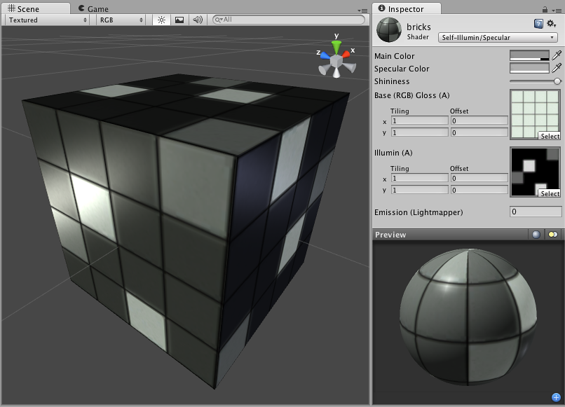

自发光镜面反射 (Self-Illuminated Specular)
=========================

**注意：**Unity 5 引入了[标准着色器](shader-StandardShader.html)来取代此着色器。

 

Self-Illuminated Properties
---------------------------

**注意：**Unity 5 引入了[标准着色器](shader-StandardShader.html)来取代此着色器。

This shader allows you to define bright and dark parts of the object. The alpha channel of a secondary texture will define areas of the object that "emit" light by themselves, even when no light is shining on it. In the alpha channel, black is zero light, and white is full light emitted by the object. Any scene lights will add illumination on top of the shader's illumination. So even if your object does not emit any light by itself, it will still be lit by lights in your scene.
 

Specular Properties
-------------------

Specular computes the same simple (Lambertian) lighting as Diffuse, plus a viewer dependent specular highlight. This is called the Blinn-Phong lighting model. It has a specular highlight that is dependent on surface angle, light angle, and viewing angle. The highlight is actually just a realtime-suitable way to simulate blurred reflection of the light source. The level of blur for the highlight is controlled with the __Shininess__ slider in the __Inspector__.

Additionally, the alpha channel of the main texture acts as a Specular Map (sometimes called "gloss map"), defining which areas of the object are more reflective than others. Black areas of the alpha will be zero specular reflection, while white areas will be full specular reflection. This is very useful when you want different areas of your object to reflect different levels of specularity. For example, something like rusty metal would use low specularity, while polished metal would use high specularity. Lipstick has higher specularity than skin, and skin has higher specularity than cotton clothes. A well-made Specular Map can make a huge difference in impressing the player.
 

性能
-----------

通常，此着色器的渲染成本属于中等。有关更多详细信息，请查看[着色器性能页面](shader-Performance.html)。
