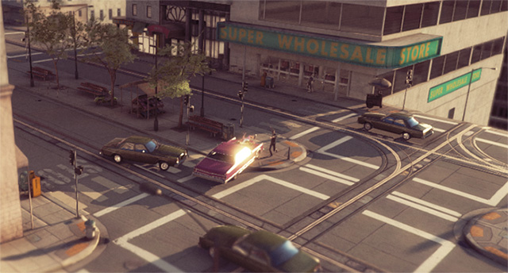

#标准着色器

Unity 标准着色器是一个包含一整套功能的内置着色器。此着色器可用于渲染“真实世界”的对象，如石头、木头、玻璃、塑料和金属，并支持各种着色器类型和组合。只需在材质编辑器中使用或不使用各种纹理字段和参数即可启用或禁用此着色器的功能。

标准着色器还包含一种称为__基于物理着色 (Physically Based Shading)__ 的高级光照模型。基于物理着色 (PBS) 以一种模仿现实的方式模拟材质和光照之间的相互作用。PBS 最近才在实时图形中成为可能。在光照和材质需要以直观而逼真的状态共存的情况下，这种光照模型的效果最佳。

我们基于物理着色背后的理念是创建一种用户友好的方法，在不同的光照条件下实现一致、合理的外观。它模拟了光在现实中的表现，而不使用可能有效或无效的多个临时模型。为此，它遵循物理学原理，包括能量守恒（意味着对象反射的光绝不会多于接受的光）、菲涅耳反射（所有表面在掠射角处具有更高的反射率）以及表面如何遮挡自身（所谓的几何术语）等等。

标准着色器在设计时就考虑了硬表面（也称为“建筑材质”），能够处理大多数现实世界的材质，如石头、玻璃、陶瓷、黄铜、银或橡胶。甚至对于皮肤、头发和布料等非硬质材质也表现得很不错。

通过标准着色器，可将大量着色器类型（例如漫射、镜面反射、凹凸镜面反射、反射）组合到同一个可处理所有材质类型的着色器中。这样做的好处是，在场景的所有区域都使用相同的光照计算，从而在使用该着色器的所有模型中提供逼真、一致且可信的光照和着色分布。

##术语

在谈论 Unity 中的基于物理着色时，有许多概念非常有用。这些概念包括：

* __能量守恒 (Energy conservation)__ - 这是一种物理学概念，可确保对象反射的光绝不会多于接受的光。材质的镜面反射越强，其漫射就应该越弱；表面越平滑，高光越强且高光面积越小。

* __高动态范围 (High Dynamic Range, HDR)__ - 这是指超出常规 0-1 范围的颜色。例如，太阳很容易比蓝天亮十倍。有关深入讨论，请参阅 Unity 手册 [HDR](HDR.html) 页面。

