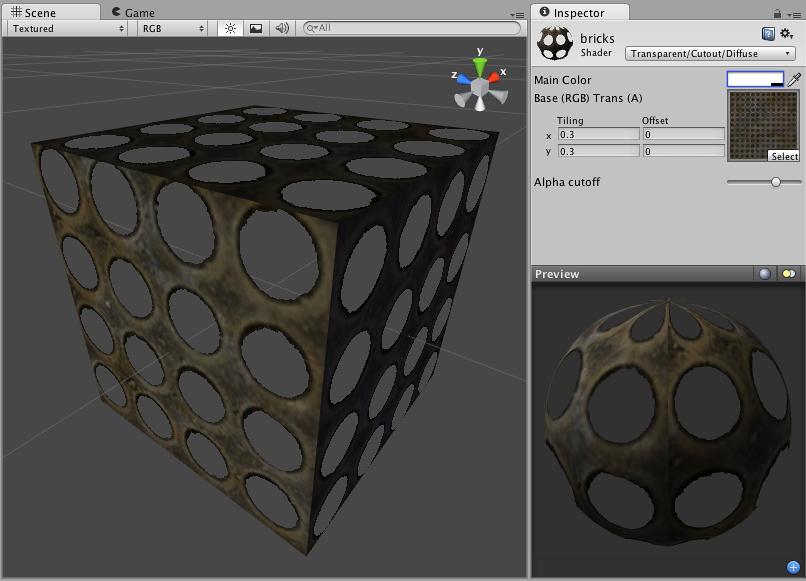

透明镂空漫射 (Transparent Cutout Diffuse)
==========================

**注意：**Unity 5 引入了[标准着色器](shader-StandardShader.html)来取代此着色器。

 

Transparent Cutout Properties
-----------------------------

**注意：**Unity 5 引入了[标准着色器](shader-StandardShader.html)来取代此着色器。

Cutout shader is an alternative way of displaying transparent objects. Differences between Cutout and regular [Transparent](shader-TransparentFamily.html) shaders are:

* This shader cannot have partially transparent areas. Everything will be either fully opaque or fully transparent.
* Objects using this shader can cast and receive shadows!
* The graphical sorting problems normally associated with Transparent shaders do not occur when using this shader.

This shader uses an alpha channel contained in the __Base__ Texture to determine the transparent areas. If the alpha contains a blend between transparent and opaque areas, you can manually determine the cutoff point for the which areas will be shown. You change this cutoff by adjusting the __Alpha Cutoff__ slider.
 

Diffuse Properties
------------------

Diffuse computes a simple (Lambertian) lighting model. The lighting on the surface decreases as the angle between it and the light decreases. The lighting depends only on this angle, and does not change as the camera moves or rotates around.
 

性能
-----------

通常，此着色器的渲染成本低。有关更多详细信息，请查看[着色器性能页面](shader-Performance.html)。
