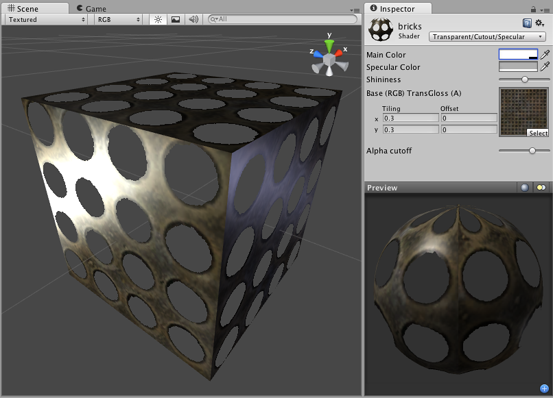

透明镂空镜面反射 (Transparent Cutout Specular)
===========================

**注意：**Unity 5 引入了[标准着色器](shader-StandardShader.html)来取代此着色器。

 

此着色器的一个注意事项是基础纹理的 Alpha 通道同时定义透明区域以及镜面贴图。

Transparent Cutout Properties
-----------------------------

**注意：**Unity 5 引入了[标准着色器](shader-StandardShader.html)来取代此着色器。

Cutout shader is an alternative way of displaying transparent objects. Differences between Cutout and regular [Transparent](shader-TransparentFamily.html) shaders are:

* This shader cannot have partially transparent areas. Everything will be either fully opaque or fully transparent.
* Objects using this shader can cast and receive shadows!
* The graphical sorting problems normally associated with Transparent shaders do not occur when using this shader.

This shader uses an alpha channel contained in the __Base__ Texture to determine the transparent areas. If the alpha contains a blend between transparent and opaque areas, you can manually determine the cutoff point for the which areas will be shown. You change this cutoff by adjusting the __Alpha Cutoff__ slider.
 

Specular Properties
-------------------

Specular computes the same simple (Lambertian) lighting as Diffuse, plus a viewer dependent specular highlight. This is called the Blinn-Phong lighting model. It has a specular highlight that is dependent on surface angle, light angle, and viewing angle. The highlight is actually just a realtime-suitable way to simulate blurred reflection of the light source. The level of blur for the highlight is controlled with the __Shininess__ slider in the __Inspector__.

Additionally, the alpha channel of the main texture acts as a Specular Map (sometimes called "gloss map"), defining which areas of the object are more reflective than others. Black areas of the alpha will be zero specular reflection, while white areas will be full specular reflection. This is very useful when you want different areas of your object to reflect different levels of specularity. For example, something like rusty metal would use low specularity, while polished metal would use high specularity. Lipstick has higher specularity than skin, and skin has higher specularity than cotton clothes. A well-made Specular Map can make a huge difference in impressing the player.
 

性能
-----------

通常，此着色器的渲染成本属于中等。有关更多详细信息，请查看[着色器性能页面](shader-Performance.html)。
