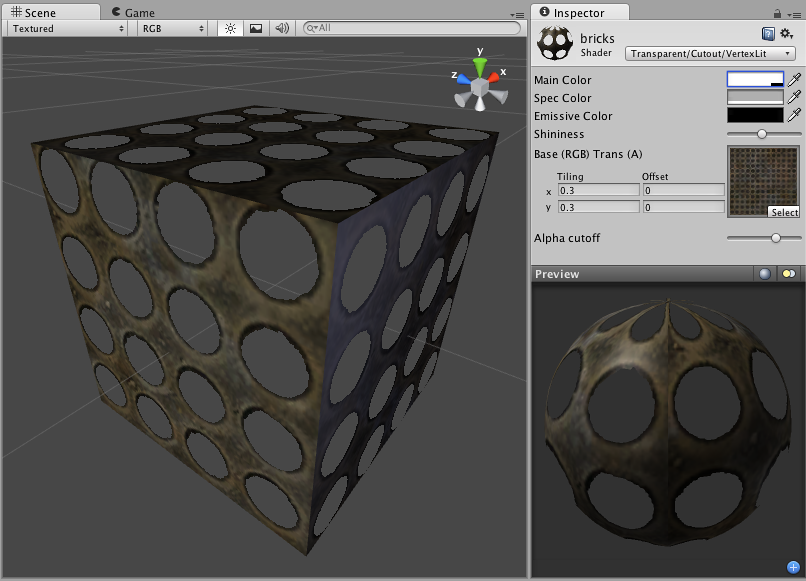

透明镂空顶点光照 (Transparent Cutout Vertex-Lit)
=============================

**注意：**Unity 5 引入了[标准着色器](shader-StandardShader.html)来取代此着色器。

 

Transparent Cutout Properties
-----------------------------

**注意：**Unity 5 引入了[标准着色器](shader-StandardShader.html)来取代此着色器。

Cutout shader is an alternative way of displaying transparent objects. Differences between Cutout and regular [Transparent](shader-TransparentFamily.html) shaders are:

* This shader cannot have partially transparent areas. Everything will be either fully opaque or fully transparent.
* Objects using this shader can cast and receive shadows!
* The graphical sorting problems normally associated with Transparent shaders do not occur when using this shader.

This shader uses an alpha channel contained in the __Base__ Texture to determine the transparent areas. If the alpha contains a blend between transparent and opaque areas, you can manually determine the cutoff point for the which areas will be shown. You change this cutoff by adjusting the __Alpha Cutoff__ slider.
 

Vertex-Lit Properties
---------------------

**注意：**Unity 5 引入了[标准着色器](shader-StandardShader.html)来取代此着色器。

This shader is __Vertex-Lit__, which is one of the simplest shaders. All lights shining on it are rendered in a single pass and calculated at vertices only.

Because it is vertex-lit, it won't display any pixel-based rendering effects, such as light cookies, normal mapping, or shadows. This shader is also much more sensitive to tesselation of the models. If you put a point light very close to a cube using this shader, the light will only be calculated at the corners. Pixel-lit shaders are much more effective at creating a nice round highlight, independent of tesselation. If that's an effect you want, you may consider using a pixel-lit shader or increase tesselation of the objects instead.
 

性能
-----------

通常，此着色器的渲染成本很低。有关更多详细信息，请查看[着色器性能页面](shader-Performance.html)。
