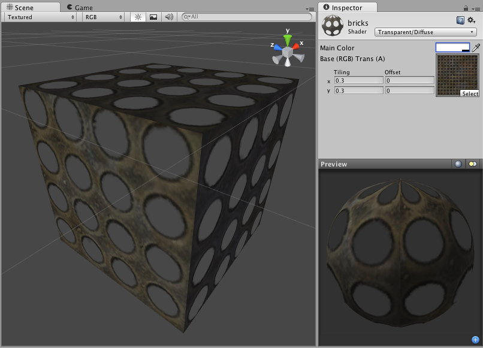

透明漫射 (Transparent Diffuse)
===================

**注意：**Unity 5 引入了[标准着色器](shader-StandardShader.html)来取代此着色器。

 

Transparent Properties
----------------------

**注意：**Unity 5 引入了[标准着色器](shader-StandardShader.html)来取代此着色器。

This shader can make mesh geometry partially or fully transparent by reading the alpha channel of the main texture. In the alpha, 0 (black) is completely transparent while 255 (white) is completely opaque. If your main texture does not have an alpha channel, the object will appear completely opaque.

Using transparent objects in your game can be tricky, as there are traditional graphical programming problems that can present sorting issues in your game. For example, if you see odd results when looking through two windows at once, you're experiencing the classical problem with using transparency. The general rule is to be aware that there are some cases in which one transparent object may be drawn in front of another in an unusual way, especially if the objects are intersecting, enclose each other or are of very different sizes. For this reason, you should use transparent objects if you need them, and try not to let them become excessive. You should also make your designer(s) aware that such sorting problems can occur, and have them prepare to change some design to work around these issues.
 

Diffuse Properties
------------------

Diffuse computes a simple (Lambertian) lighting model. The lighting on the surface decreases as the angle between it and the light decreases. The lighting depends only on this angle, and does not change as the camera moves or rotates around.
 

性能
-----------

通常，此着色器的渲染成本低。有关更多详细信息，请查看[着色器性能页面](shader-Performance.html)。
