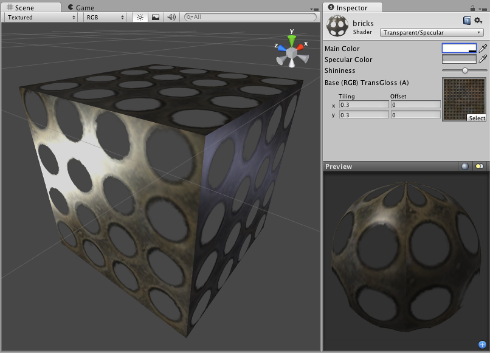

透明镜面反射 (Transparent Specular)
====================

**注意：**Unity 5 引入了[标准着色器](shader-StandardShader.html)来取代此着色器。

 

此着色器的一个注意事项是基础纹理的 Alpha 通道同时定义透明区域以及镜面贴图。

Transparent Properties
----------------------

**注意：**Unity 5 引入了[标准着色器](shader-StandardShader.html)来取代此着色器。

This shader can make mesh geometry partially or fully transparent by reading the alpha channel of the main texture. In the alpha, 0 (black) is completely transparent while 255 (white) is completely opaque. If your main texture does not have an alpha channel, the object will appear completely opaque.

Using transparent objects in your game can be tricky, as there are traditional graphical programming problems that can present sorting issues in your game. For example, if you see odd results when looking through two windows at once, you're experiencing the classical problem with using transparency. The general rule is to be aware that there are some cases in which one transparent object may be drawn in front of another in an unusual way, especially if the objects are intersecting, enclose each other or are of very different sizes. For this reason, you should use transparent objects if you need them, and try not to let them become excessive. You should also make your designer(s) aware that such sorting problems can occur, and have them prepare to change some design to work around these issues.
 

Specular Properties
-------------------

Specular computes the same simple (Lambertian) lighting as Diffuse, plus a viewer dependent specular highlight. This is called the Blinn-Phong lighting model. It has a specular highlight that is dependent on surface angle, light angle, and viewing angle. The highlight is actually just a realtime-suitable way to simulate blurred reflection of the light source. The level of blur for the highlight is controlled with the __Shininess__ slider in the __Inspector__.

Additionally, the alpha channel of the main texture acts as a Specular Map (sometimes called "gloss map"), defining which areas of the object are more reflective than others. Black areas of the alpha will be zero specular reflection, while white areas will be full specular reflection. This is very useful when you want different areas of your object to reflect different levels of specularity. For example, something like rusty metal would use low specularity, while polished metal would use high specularity. Lipstick has higher specularity than skin, and skin has higher specularity than cotton clothes. A well-made Specular Map can make a huge difference in impressing the player.
 

性能
-----------

通常，此着色器的渲染成本属于中等。有关更多详细信息，请查看[着色器性能页面](shader-Performance.html)。
