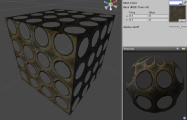
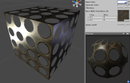
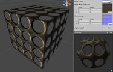
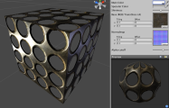

透明镂空着色器系列
================================

**注意：**Unity 5 引入了[标准着色器](shader-StandardShader.html)来取代这些着色器。

透明镂空 (Transparent Cutout) 着色器用于处理具有完全不透明和完全透明部分（非半透明）的对象。像铁丝网、树木、草等等便是此类对象。

[透明镂空顶点光照 (Transparent Cutout Vertex-Lit)](shader-TransCutVertexLit.html)
---------------------------------------------------------

**需要的资源：**

* 一个__基础__纹理以及用于透明贴图的 Alpha 通道

[&amp;#187; 更多详细信息](shader-TransCutVertexLit.html)

[透明镂空漫射 (Transparent Cutout Diffuse)](shader-TransCutDiffuse.html)
----------------------------------------------------

**需要的资源：**

* 一个__基础__纹理以及用于透明贴图的 Alpha 通道

[&amp;#187; 更多详细信息](shader-TransCutDiffuse.html)

[透明镂空镜面反射 (Transparent Cutout Specular)](shader-TransCutSpecular.html)
------------------------------------------------------

**需要的资源：**

* 一个__基础__纹理以及同时用于透明贴图/镜面贴图的 Alpha 通道

**注意：**
此着色器的一个限制是__基础__纹理的 Alpha 通道将同时兼作此着色器系列中镜面反射着色器的镜面贴图。

[&amp;#187; 更多详细信息](shader-TransCutSpecular.html)

[透明镂空凹凸 (Transparent Cutout Bumped)](shader-TransCutBumpedDiffuse.html)
---------------------------------------------------------

**需要的资源：**

* 一个__基础__纹理以及用于透明贴图的 Alpha 通道
* 一个__法线贴图__，无需 Alpha 通道

[&amp;#187; 更多详细信息](shader-TransCutBumpedDiffuse.html)

[透明镂空凹凸镜面反射 (Transparent Cutout Bumped Specular)](shader-TransCutBumpedSpecular.html)
-------------------------------------------------------------------

**需要的资源：**

* 一个__基础__纹理以及同时用于透明贴图/镜面贴图的 Alpha 通道
* 一个__法线贴图__，无需 Alpha 通道

**注意：**
此着色器的一个限制是__基础__纹理的 Alpha 通道将同时兼作此着色器系列中镜面反射着色器的镜面贴图。

[&amp;#187; 更多详细信息](shader-TransCutBumpedSpecular.html)
