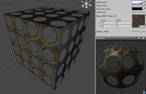
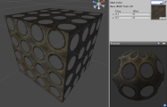
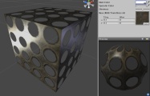
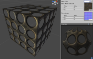
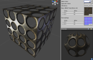
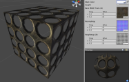
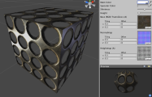

透明着色器系列
=========================

**注意：**Unity 5 引入了[标准着色器](shader-StandardShader.html)来取代这些着色器。

透明 (Transparent) 着色器用于全透明或半透明对象。通过使用__基础__纹理的 Alpha 通道，可确定对象的区域的透明度高于或低于其他区域。这种着色器可为玻璃、HUD（抬头显示）界面或科幻场景带来很好的效果。

[透明顶点光照 (Transparent Vertex-Lit)](shader-TransVertexLit.html)
-----------------------------------------------

**需要的资源：**

* 一个__基础__纹理以及用于透明贴图的 Alpha 通道

[&amp;#187; 更多详细信息](shader-TransVertexLit.html)

[透明漫射 (Transparent Diffuse)](shader-TransDiffuse.html)
------------------------------------------

**需要的资源：**

* 一个__基础__纹理以及用于透明贴图的 Alpha 通道

[&amp;#187; 更多详细信息](shader-TransDiffuse.html)

[透明镜面反射 (Transparent Specular)](shader-TransSpecular.html)
--------------------------------------------

**需要的资源：**

* 一个__基础__纹理以及同时用于透明贴图/镜面贴图的 Alpha 通道

**注意：**
此着色器的一个限制是__基础__纹理的 Alpha 通道将同时兼作此着色器系列中镜面反射着色器的镜面贴图。

[&amp;#187; 更多详细信息](shader-TransSpecular.html)

[透明法线贴图 (Transparent Normal mapped)](shader-TransBumpedDiffuse.html)
------------------------------------------------------

**需要的资源：**

* 一个__基础__纹理以及用于透明贴图的 Alpha 通道
* 一个__法线贴图__，无需 Alpha 通道

[&amp;#187; 更多详细信息](shader-TransBumpedDiffuse.html)

[透明法线贴图镜面反射 (Transparent Normal mapped Specular)](shader-TransBumpedSpecular.html)
----------------------------------------------------------------

**需要的资源：**

* 一个__基础__纹理以及同时用于透明贴图/镜面贴图的 Alpha 通道
* 一个__法线贴图__，无需 Alpha 通道

**注意：**
此着色器的一个限制是__基础__纹理的 Alpha 通道将同时兼作此着色器系列中镜面反射着色器的镜面贴图。

[&amp;#187; 更多详细信息](shader-TransBumpedSpecular.html)

[透明视差 (Transparent Parallax)](shader-TransParallaxDiffuse.html)
---------------------------------------------------

**需要的资源：**

* 一个__基础__纹理以及用于透明贴图的 Alpha 通道
* 一个__法线贴图__以及用于视差深度的 Alpha 通道

[&amp;#187; 更多详细信息](shader-TransParallaxDiffuse.html)

[透明视差镜面反射 (Transparent Parallax Specular)](shader-TransParallaxSpecular.html)
-------------------------------------------------------------

**需要的资源：**

* 一个__基础__纹理以及同时用于透明贴图/镜面贴图的 Alpha 通道
* 一个__法线贴图__以及用于视差深度的 Alpha 通道

**注意：**
此着色器的一个限制是__基础__纹理的 Alpha 通道将同时兼作此着色器系列中镜面反射着色器的镜面贴图。

[&amp;#187; 更多详细信息](shader-TransParallaxSpecular.html)
