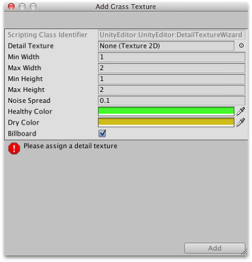

#草和其他细节

地形上可能有草丛和其他小对象，如地形表面覆盖的岩石。我们使用 2D 图像来渲染草，从而表现草丛，同时从标准网格生成其他细节。

##启用细节

工具栏上的细节按钮可启用草/细节绘制。

 

最初，地形上没有草和细节，但如果单击检视面板中的 _Edit Details_ 按钮，您将在出现的菜单上看到 _Add Grass Texture_ 和 _Add Detail Mesh_ 选项。此情况下将出现一个窗口，您可以在其中为正在绘制的地形添加资源。

对于草，该窗口如下所示：

_Detail Texture_ 是表示草的纹理。从 Asset Store 下载的 Unity 标准资源中包含一些合适的纹理。您也可以自己创建。纹理只是一个小图像，图像中的空白区域的 Alpha 设置为零。（当然，这里的“草”(Grass) 是一个通用术语，实际上您可以使用图像来表示花朵、画笔甚至铁丝网等人造物体。）

_Min Width_、_Min Height_、_Max Width_ 和 _Max Height_ 值可指定生成的草丛大小的上限和下限。为了获得逼真的外观，草是以随机“噪点”图案生成的，有裸露斑块散布在草地上。

_Noise Spread_ 值控制着交替斑块的近似大小，值越高表示给定区域内的变化越大。（技术说明：噪点实际上是使用_柏林噪声 (Perlin noise)_ 生成的；噪点扩散 (Noise Spread) 是指在地形上的 x、y 位置与噪点图像之间应用的缩放。）通常认为，交替的草地斑块处于中心位置比处于边缘位置更“健康”，而 _Healthy/Dry Color_ 设置的作用就是通过草丛的颜色显示草丛的健康状态。

最后，当启用 _Billboard_ 选项时，草的图像将旋转，因此它们将始终面向摄像机。当您希望显示密集的草地时，此选项可能非常有用，因为不可能从侧面观看草丛（这样看起来是二维的）。然而，对于稀疏的草，草丛个体的旋转可能会变得很明显，产生奇怪的效果。

对于细节网格，例如岩石，选择窗口如下所示：

_Detail_ 属性用于从项目中选择预制件，该预制件将根据各个实例的 _Random Width_ 和 _Random Height_ 值进行缩放。_Noise Spread_ 和 _Healthy/Dry Color_ 值的作用与它们对草的作用相同（但“健康”的概念在应用于像岩石这样的对象时会有所延伸！）_Render Mode_ 可设置为 _Grass_ 或 _Vertex Lit_。在 _Grass_ 模式中，场景中细节对象的实例将被展平为 2D 图像，其行为类似于草纹理。在 _Vertex Lit_ 模式中，细节将渲染为场景中的实体顶点光照对象。
