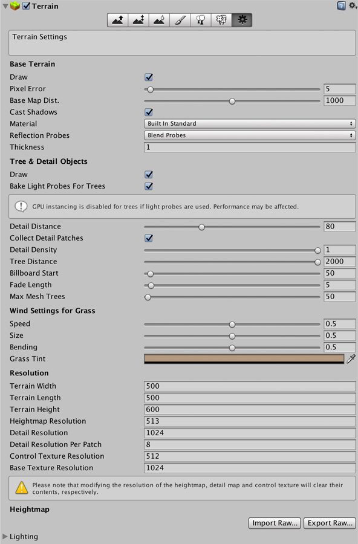

# 地形设置 (Terrain Settings)

地形工具栏上的最后一个工具是地形设置工具：

 

##设置检视面板 (Settings Inspector)

此位置提供了许多总体使用和渲染选项的设置，如下所述：

 

###Base Terrain

|**_属性：_** ||**_功能：_** |
|:---|:---|:---|
|__Draw__ ||打开/关闭地形渲染。 |
|__Pixel Error__ ||地形贴图（高度贴图、纹理等）与生成的地形之间的映射精度；值越高表示精度越低，但渲染开销越低。 |
|__Base Map Distance__ ||地形纹理以全分辨率显示的最大距离。超过此距离后将使用较低分辨率的合成图像来提高效率。 |
|__Cast Shadows__ ||地形是否投射阴影？ |
|__Material__ ||用于渲染地形的材质。这将影响对地形纹理的颜色通道的解释。请参阅[启用纹理](terrain-Textures.html)以了解详细信息。可用选项为： |
||_Built In Standard_|这是 Unity 5.0 中引入的 PBR（基于物理渲染）材质。对于每个泼溅 (Splat) 层，可将一个纹理用于反照率和平滑度，一个纹理用于法线，一个标量值用于调整金属度。有关 PBR 和标准着色器的更多信息，请参阅[标准着色器](shader-StandardShader.html)。 注意：在 Direct3D 9 上的 Shader Model 3.0 中，如果启用了[方向光照贴图](LightmappingDirectional.html)、[烘焙全局光照](UsingPrecomputedLighting.html)、实时[阴影](ShadowOverview.html)和[阴影遮罩](LightMode-Mixed-Shadowmask.html)，则无法使用法线贴图。这是由于着色器中的采样器数量有限。|
||_Built In Legacy Diffuse_|这是 Unity 4.x 及之前版本的旧版内置地形材质。此类材质使用兰伯特（Lambert，仅作为漫射术语）光照模型，并具有可选的法线贴图支持。 |
||_Built In Legacy Specular_|此内置材质使用 BlinnPhong（漫射和镜面反射术语）光照模型，并具有可选的法线贴图支持。您可以指定地形的整体镜面反射颜色和光泽度。 |
||_Custom_|使用自选的自定义材质渲染地形。此材质应使用专门用于地形渲染的着色器（例如，它应该能正确处理纹理泼溅）。建议您查看我们的内置地形着色器的源代码，并在它们的基础之上进行修改。 |
|__Reflection Probes__||如何在地形上使用反射探针。仅在使用内置标准材质或支持反射渲染的自定义材质时才有效。可用选项为： |
||_Off_|禁用反射探针，将天空盒用于反射。 |
||_Blend Probes_|启用反射探针。混合仅在两个探针之间发生。如果附近没有反射探针，则将使用默认反射，但默认反射和探针之间不会发生混合。 |
||_Blend Probes And Skybox_|启用反射探针。混合发生在探针之间或探针与默认反射之间。 |
||_Simple_|启用反射探针，但当存在两个重叠的探针体积时，探针之间不会发生混合。 |
|__Thickness__ ||地形碰撞体积应沿负 Y 轴延伸的量。对象与地形碰撞后即产生等于此厚度 (Thickness) 的地表深度。此设置有助于防止高速移动的物体穿透地形而无需使用成本高昂的连续碰撞检测。 |

###Tree and Detail Objects

|**_属性：_** |**_功能：_** |
|:---|:---|
|__Draw__ |是否应绘制树、草和细节？ |
|__Bake Light Probes For Trees__| 如果启用此选项，Unity 将在每棵树的上方创建光照探针，并将它们应用于树渲染器以便渲染光照。否则，树仍然受环境探针和光照探针组的影响。 |
|__Detail Distance__ |超过此距离（与摄像机之间）将剔除细节。 |
|__Detail Density__ |给定单位面积内的细节/草对象数量。可将该值设置得较低以便减少渲染开销。 |
|__Tree Distance__ |超过此距离（与摄像机之间）将剔除树。 |
|__Billboard Start__ |位于此距离（与摄像机之间）的 3D 树对象将由公告牌图像取代。 |
|__Fade length__ |树在 3D 对象和公告牌之间过渡的距离。 |
|__Max Mesh Trees__ |表示为实体 3D 网格的可见树的最大数量。超出此限制时，树将被公告牌取代。 |

###Wind Settings

|**_属性：_** |**_功能：_** |
|:---|:---|
|__Speed__ |风吹草时的速度。 |
|__Size__ |风吹过草地时出现的“波纹”大小。 |
|__Bending__ |草对象被风吹弯的程度。 |
|__Grass Tint__ |应用于草对象的整体颜色色调。 |

###Resolution

|**_属性：_** |**_功能：_** |
|:---|:---|
|__Terrain Width__ |地形对象在 X 轴上的大小（以世界单位表示）。 |
|__Terrain Length__ |地形对象在 Z 轴上的大小（以世界单位表示）。 |
|__Terrain Height__ |最低可能高度贴图值与最高值之间的 Y 坐标差异（以世界单位表示）。 |
|__Heightmap Resolution__ |地形高度贴图的像素分辨率（应该是 2 的幂加 1，例如 513 = 512 + 1）。 |
|__Detail Resolution__ |确定单独细节/草斑块的贴图分辨率。分辨率越高，斑块越小、细节越多。 |
|__Detail Resolution Per Patch__ |通过单次绘制调用渲染的斑块方形的长度/宽度。 |
|__Control Texture Resolution__ |控制不同地形纹理之间混合的“泼溅贴图”(splatmap) 的分辨率。 |
|__Base Texture Resolution__ |在地形上使用的复合纹理从大于 _Basemap Distance_（见上文）的距离查看时的分辨率。 |

###高度贴图 Import/Export 按钮
_Import Raw_ 和 _Export Raw_ 按钮允许您将地形的高度贴图设置或保存为 RAW 灰度格式的图像文件。RAW 格式可由第三方地形编辑工具（如 Bryce）生成，也可由 Photoshop 打开、编辑和保存。因此可在 Unity 之外以复杂的方式生成和编辑地形。

---

*  2017-09-06  Page amended with limited [editorial review](DocumentationEditorialReview.html)

* 在 [2017.2](https://docs.unity3d.com/2017.2/Documentation/Manual/30_search.html?q=newin20171) 版中添加了 Cast Shadows 标志 NewIn20172

* 在 5.6 版中添加了“光照模式”

* 在 5.6 版中更新了树光照贴图制作
