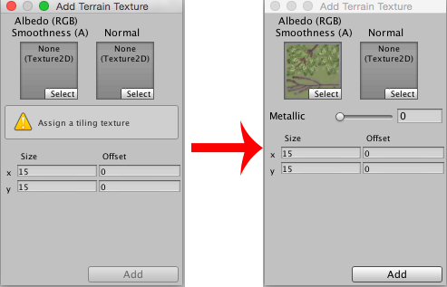
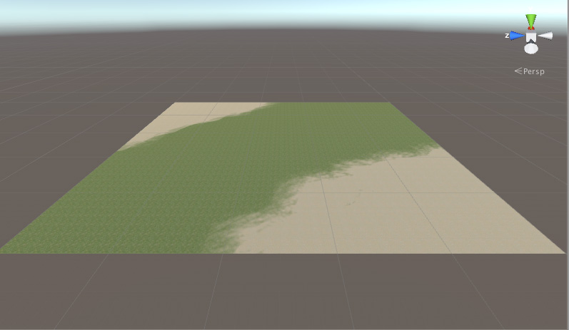

#地形纹理

您可以将纹理图像添加到地形表面以创建自然色彩和精细的细节。由于地形是如此之大的对象，因此标准做法是使用无缝重复的纹理并将其平铺在表面上（从角色靠近地面的角度来看，重复通常是不明显的）。一个纹理将作为地形上的 “背景” 图像，但也可以绘制不同纹理的区域来模拟不同的地面，如草地、沙漠和雪地。绘制的纹理可应用不同的透明度，因此您可以在草地覆盖的乡村与沙滩之间逐渐过渡。

##启用纹理

工具栏上的画笔按钮可启用纹理绘制功能。

 

最初，地形未指定要绘制的纹理。如果单击 _Edit Textures_ 按钮并从菜单中选择 _Add Texture_，您将看到 _Add Terrain Texture_ 窗口。在此处可设置纹理及其属性。

根据您在[地形设置 (Terrain Settings)](terrain-OtherSettings.html) 中设置的材质类型，主纹理贴图的颜色通道可能具有不同的用途。这些均列在了下面的*地形纹理设置（Terrain Texture Settings）*中。

单击 _Select_ 可在单独的 _Select Texture_ 窗口（此处未显示）中查看纹理资源。单击所需的纹理，随后该纹理将显示在 _Add Terrain Texture_ 窗口中。（请参阅下方*图 1* 操作前后的 _Add Terrain Texture_ 窗口。）

### 地形纹理设置

根据您在[地形设置 (Terrain Settings)](terrain-OtherSettings.html) 中设置的材质类型，主纹理贴图的颜色通道可能具有不同的用途。下面列出了不同的 _Add Terrain Texture_ 窗口。

**标准 (Standard)** [上面*图 1* 中的图]：RGB 通道是地形表面的反照率颜色，而 Alpha 通道控制着平滑度。此外，还有一个“Metallic”滑动条用于控制表面的整体外观。

**漫射 (Diffuse)**：RGB 通道是漫射颜色。不使用 Alpha 通道。

**镜面反射 (Specular)**：RGB 通道是漫射颜色。Alpha 通道是光泽贴图。

**自定义 (Custom)**：如何使用泼溅贴图取决于您的自定义着色器，但通常您希望以 RGB 通道为基色。

除了主纹理贴图外，还可为所有 3 种内置材质类型指定法线纹理。此处使用的法线纹理的纹理类型必须为“法线贴图 (Normal Map)”（可在导入设置中更改纹理资源的纹理类型）。只有在为地形设置了至少一个法线纹理时，才会启用处理法线贴图的着色器代码，因此如果不使用法线贴图，则无需承担法线贴图的性能成本。

_Size_ 属性（位于纹理框下方）用于设置图像在地形表面上拉伸的宽度和高度。_Offset_ 属性决定了平铺的开始位置与地形锚点之间的距离；您可以将此属性设置为零以便直接从角点开始平铺。根据自己的喜好设置纹理和属性后，单击 __Apply__ 按钮即可使纹理可用于地形。

要更改添加的地形纹理，请选择其缩略图，单击“Edit Textures”按钮，然后从菜单中选择“Edit Texture...”。或者，直接双击其缩略图即可。要删除地形纹理，请选择其缩略图，单击“Edit Textures”按钮，然后从菜单中选择“Remove Texture”。

请注意，如果要将纹理分配给地形，则需要打开纹理导入器 (Texture Importer) 并勾选 __Read/Write Enabled__ 复选框。

##纹理绘制

您添加的第一个纹理将用作“背景”来覆盖地形。但是，您可以根据需要添加任意数量的纹理；后续的纹理将可通过熟悉的画笔工具进行绘制。在 Terrain Inspector 中的纹理下方，除了有常规的 _Brush Size_ 和 _Opacity_ 选项，还有一个名为 _Target Strength_ 的附加选项。此选项将设置画笔即使重复经过同一点也会进行累积的最大不透明度值。借助这种设置可在单个地形类型中添加细微的色块变化，从而打破以相同纹理区块多次重复的大型平坦区域的单调乏味状态。

