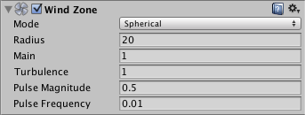

#风区（Wind Zones）

使用__风区 (Wind Zone)__ 组件添加一个或多个对象，即可在地形上创建风的效果。风区内的树将以逼真的动画弯曲，而风本身将以脉冲方式移动，从而在树之间营造自然的运动模式。

##使用风区（Using Wind Zones）
可直接创建风区对象（菜单：__GameObject &gt; 3D Object &gt; Wind Zone__），也可将该组件添加到场景中已有的任何合适对象（菜单：__Component &gt; Miscellaneous &gt; Wind Zone__）。风区的检视面板提供了许多选项来控制其行为。

_Mode_ 可设置为 _Directional_ 或 _Spherical_。在 _Directional_ 模式中，风会立即影响整个地形，而 _Spherical_ 模式在 _Radius_ 属性定义的球体内向外吹风。定向风对于创建树的自然运动更有用，而球形风更适合爆炸等特殊效果。

_Main_ 属性决定了风的整体强度，但是使用 _Turbulence_ 可带来一点随机变化。如上所述，风以脉冲方式吹过树，从而产生更自然的效果。可使用 _Pulse Magnitude_ 和 _Pulse Frequency_ 属性控制脉冲强度以及脉冲之间的时间间隔。

##粒子系统（Particle Systems）
风的主要用途是实现树的动画化，但它也可使用 _External Forces_ 模块来影响粒子系统生成的粒子。有关更多详细信息，请参阅[粒子系统](class-ParticleSystem.html)的参考页面。

