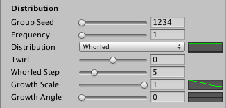
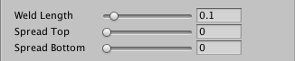
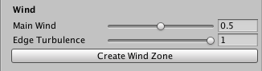

树枝组属性 (Branch Group Properties)
=======================

树枝组节点负责生成树枝和树叶。选择树枝、树叶或树枝+树叶节点时，将显示其属性。

Distribution
------------

调整树枝组中的树枝数量和位置。使用曲线可微调位置、旋转和缩放。曲线相对于父级树枝或者为树干的情况下相对于区域扩散。

 

| | |
|:---|:---|
|__Group Seed__ |此树枝组的种子。修改此设置可改变程序化生成过程。|
|__Frequency__ |调整每个父级树枝创建的树枝数。|
|__Distribution__|树枝沿着父级分布的方式。|
|__Twirl__ |在父级树枝周围转动。|
|__Whorled Step__|定义使用轮生 (Whorled) 分布时每个轮生步骤中有多少个节点。对于真正的植物，这通常是斐波纳契数。|
|__Growth Scale__|定义沿着父节点生长的节点的比例。使用曲线进行调整并使用滑动条使效果淡入淡出。|
|__Growth Angle__|定义相对于父级的初始生长角度。使用曲线进行调整并使用滑动条使效果淡入淡出。|

Geometry
--------

选择为此树枝组生成的几何体类型以及应用的材质。__LOD Multiplier__ 允许您调整此组相对于树的 __LOD Quality__ 的质量。

 

| | |
|:---|:---|
|__LOD Multiplier__ |调整此组相对于树的 LOD Quality 的质量，使其质量高于或低于树的其余部分。|
|__Geometry Mode__ |此树枝组的几何体类型：Branch Only、Branch + Fronds、Fronds Only。|
|__Branch Material__|树枝的主要材质。|
|__Break Material__ |折断树枝的断面材质。|
|__Frond Material__ |树叶的材质。|

Shape
-----

调整树枝的形状和生长。使用曲线微调形状，所有曲线都是相对于树枝本身。

 

| | |
|:---|:---|
|__Length__ |调整树枝的长度。|
|__Relative Length__ |确定树枝的半径是否受其长度影响。|
|__Radius__ |调整树枝的半径，使用曲线沿树枝的长度微调半径。|
|__Cap Smoothing__ |定义树枝的断面/尖端的圆度。适用于仙人掌。|
|**Growth** |调整树枝的生长。|
|__Crinkliness__ |调整树枝的褶皱/弯曲程度，使用曲线进行微调。|
|__Seek Sun__ |使用曲线调整树枝向上/向下弯曲的方式，使用滑动条更改比例。|
|**Surface Noise** |调整树枝的表面噪点。|
|__Noise__ |整体噪点系数，使用曲线进行微调。|
|__Noise Scale U__ |树枝周围噪点的比例，较低的值将带来较摇摆的外观，而较高的值将带来较随机的外观。|
|__Noise Scale V__ |沿着树枝的噪点的比例，较低的值将带来较摇摆的外观，而较高的值将带来较随机的外观。|
|**Flare** |定义树干的光晕。|
|__Flare Radius__ |光晕的半径，此值将添加到主半径，因此零值意味着无光晕。|
|__Flare Height__ |定义光晕在树干上的跨度。|
|__Flare Noise__ |定义光晕的噪点，较低的值将带来较摇摆的外观，而较高的值将带来较随机的外观。|
|**Breaking** |控制树枝的折断。|
|__Break Chance__ |树枝折断的可能性，即 0 = 没有树枝折断，0.5 = 一半树枝折断，1.0 = 所有树枝折断。|
|__Break Location__|此范围定义树枝将被折断的位置。相对于树枝的长度。|

 

**这些属性仅适用于子树枝，而不适用于树干。**

| **Welding ** | **定义将树枝焊接到其父级树枝上。仅对二级树枝有效。** |
|:---|:---|
|__Weld Length__ |定义焊接扩散在树枝上的跨度。|
|__Spread Top__ |树枝顶端的焊接扩散系数，相对于其父级树枝。零表示无扩散。|
|__Spread Bottom__ |树枝底端的焊接扩散系数，相对于其父级树枝。零表示无扩散。|

Fronds
------

此处可调整树叶的数量及其属性。此选项卡仅在 __Geometry__ 选项卡中启用了 Frond 几何体时才可用。

 

| | |
|:---|:---|
|__Frond Count__ |定义每个树枝的树叶数。树叶总是在树枝周围均匀分布。|
|__Frond Width__ |树叶的宽度，使用曲线调整沿树枝长度的具体形状。|
|__Frond Range__ |定义树叶的起点和终点。|
|__Frond Rotation__|定义父级树枝周围的旋转。|
|__Frond Crease__ |调整以折皱/折叠树叶。|

Wind
----

调整用于动画化此树枝组的参数。风区仅在播放模式下有效。

 

| | |
|:---|:---|
|__Main Wind__ |主风效果。此效果可产生柔和的摇摆运动，通常是主树枝所需的唯一参数。|
|__Edge Turbulence__ |沿着树叶边缘的湍流。适用于蕨类植物、棕榈树等。|
|__Create Wind Zone__|创建[风区](class-WindZone.html)。|
