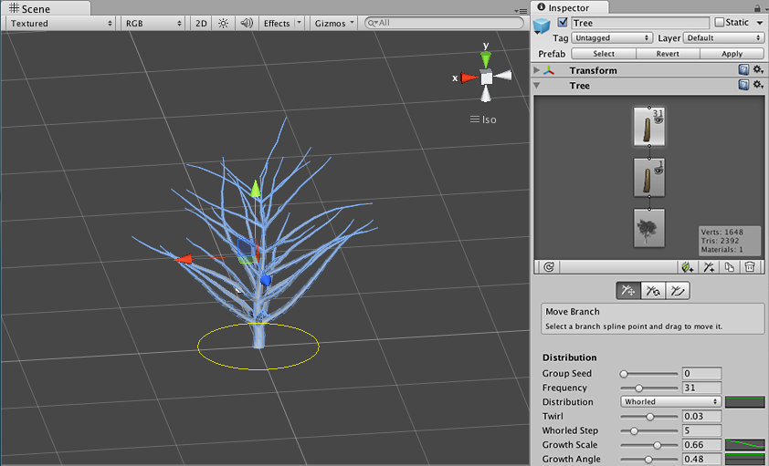
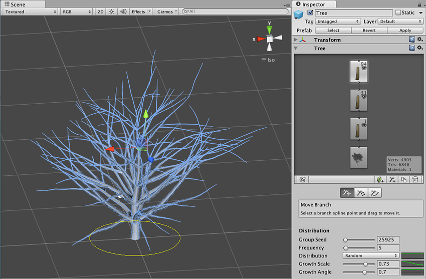
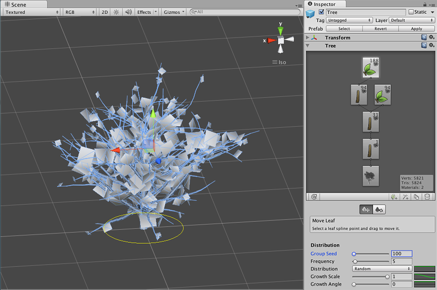
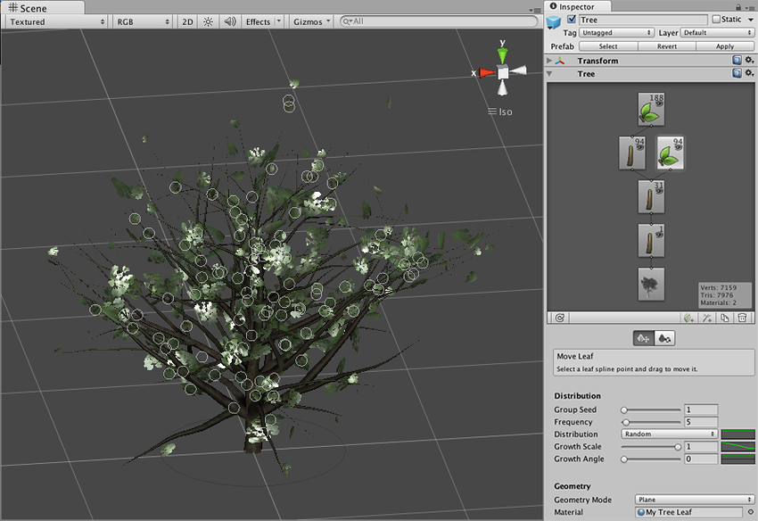
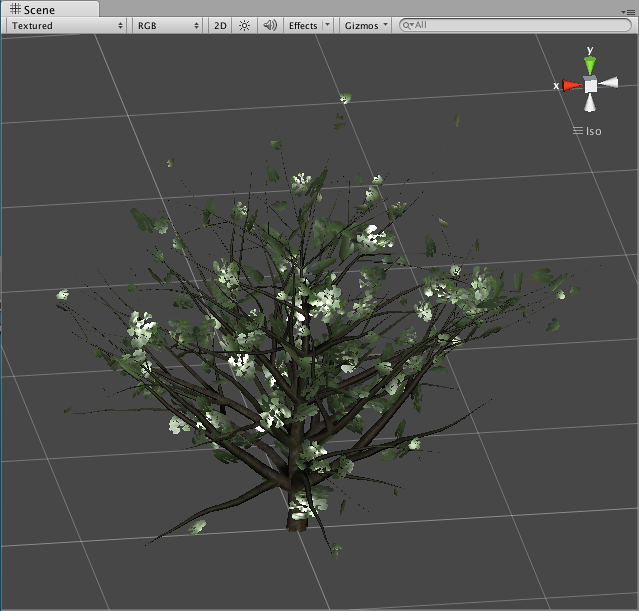

#构建第一棵树

现在，我们将引导您使用树创建工具来创建第一棵树。

##添加新树

要创建新的__树 (Tree)__ 资源，请选择 __GameObject &gt; 3D Object &gt; Tree__。您将看到在 Project 视图中创建了一个新的树资源，并在当前打开的场景中进行了实例化。这棵新树非常简单，只有一个树枝，所以让我们为其添加一些特征。

##添加树枝

选择该树即可在 __Inspector__ 中查看 __Tree__ 窗口。此界面提供了塑造和雕刻树的所有工具。您将看到__树层级视图 (Tree Hierarchy)__ 窗口，其中包含两个节点：__Tree Root__ 节点和单个 __Branch Group__ 节点，我们将其称为树干。

在__树层级视图__中，选择 __Branch Group__（充当树干）。单击 __Add Branch Group__ 按钮，随后将看到一个新的 __Branch Group__ 连接到主枝 (Main Branch)。现在，您可以尝试调整__树枝组属性 (Branch Group Properties)__ 中的设置来查看连接到树干的树枝的变化。

创建连接到树干的树枝后，我们现在可以通过连接另一个 __Branch Group__ 节点向新创建的树枝添加较小的细枝。选择二级 __Branch Group__ 并再次单击 __Add Branch Group__ 按钮。调整此组的值以创建连接到二级树枝的更多树枝。

现在树的树枝结构已经完成。我们的游戏不是发生在冬天，所以还应该在不同的树枝上添加一些__树叶__，对吧？

##添加树叶

我们通过添加__树叶组 (Leaf Group)__ 来用树叶装饰我们的树，这和刚才添加树枝组的操作基本上是一样的。选择二级 Branch Group 节点，然后单击 __Add Leaf Group__ 按钮。如果您确实很有实力，还可在最小的树枝上添加另一个树叶组。

现在，树叶被渲染成不透明的平面。这是因为我们希望在为树叶添加材质之前调整树叶的值（大小、位置、旋转等）。调整树叶 (Leaf) 值，直到找到想要的一些设置。

##添加材质

为了使树看起来更逼真，我们需要为树枝和树叶应用__材质__。请使用 __Assets &gt; Create &gt; Material__ 在项目中创建新的材质。将此材质重命名为“My Tree Bark”，然后从 Shader 下拉选单中选择 __Nature &gt; Tree Creator Bark__。在此处，可将树创建器包 (Tree Creator Package) 中提供的__纹理__分配给树皮材质 (Bark Material) 的 Base、Normalmap 和 Gloss 属性。我们建议对 Base 和 Gloss 属性使用“BigTree\_bark\_diffuse”纹理，并对 Normalmap 属性使用“BigTree\_bark\_normal”纹理。

现在我们将按照相同的步骤创建树叶材质。创建新材质并将着色器指定为 __Nature &gt; Tree Creator Leaves__。为纹理字段分配树创建器包中的树叶纹理。

两个材质都创建完成后，将它们分配给树的不同组节点。选择树并单击任何树枝或树叶节点，然后展开__树枝组属性 (Branch Group Properties)__ 的 __Geometry__ 部分。您将看到所选节点类型的材质分配字段。分配您创建的相关材质并查看结果。

为完成这棵树，请将材质分配给树中的所有__树枝组 (Branch Group)__ 和__树叶组 (Leaf Group)__ 节点。现在，您可以把您的第一棵树放进游戏中了！

##提示。

* 创建树是一个反复试验的过程。
* 不要创建太多的树叶/树枝，因为这会影响游戏的性能。
* 查看 [Alpha 贴图](HOWTO-alphamaps.html)指南了解如何创建自定义树叶。
