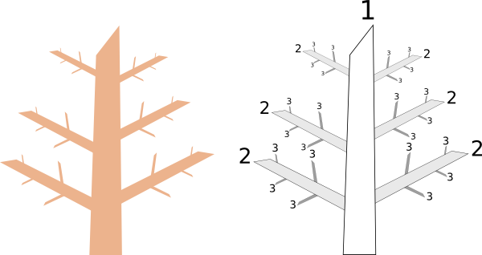
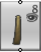
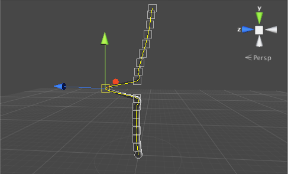

#树基础知识

在导入树创建器包 (Tree Creator Package) 后，可选择 __GameObject > 3D Object > Tree__ 将新树添加到场景中（这也将在 Project 视图中创建一个新的树资源）。此操作创建的树最初只是一根没有树叶和树枝的树干。但是，您将在检视面板中注意到该对象附加了一个树组件，这将允许您根据自己的喜好设计树。

在树组件检视面板的顶部是_树结构编辑器（tree structure editor）_，其中指定了树枝和树叶的基本排列。

在使用此编辑器时理解_树层级（tree levels）_的概念很重要。树干有树枝，而树枝又有小分支；这种分支过程一直持续到产生终端细枝。树干被视为树的第一级，然后直接从树干生长的所有树枝构成第二级。从第二级树枝形成的所有树枝一起构成第三级，依此类推。

 

这种层级概念反映在了树编辑器中。例如，请考虑以下树结构：

 

图标通过线条连接以显示树的分支层级。最底部的图标（带有树图片）表示树的“根”。选中此图标后，下面检视面板中的属性将是适用于整个树的属性。从这个根可扩展第一和第二级分支。这些图标显示了几方面的信息：

 

主图显示了这是哪种元素。右上角的数字表示树在该层级存在的树枝数，此数值由检视面板中的 _Frequency_ 属性设置。选中给定图标后，更改 _Frequency_ 值将更改该层级的树枝数。数字下方的眼睛图像表示 Scene 视图中的树枝可见性；单击眼睛可以打开或关闭可见性。

可使用树编辑器右下角的控件来编辑树枝组的排列：

 

从左到右，第一个工具用于将_树叶_组添加到树中。树叶与树枝的排列方式相同，但与树枝不同的是，树叶不能进一步细分为更多层级。第二个工具可在当前层级添加新的树枝组（即为所选树枝图标创建新的“子级”）。第三个工具可复制选择的任何组，而第四个工具可从树中删除组。在树的每个层级都可以有多个组，如下例所示：

 

这棵树有一个主干，从主干生长出两个不同的树枝组。第一个树枝组有自己的树枝和树叶子组，而第二个树枝组只有光秃秃的树枝。给定层级的各个组可分别在检视面板中以不同方式设置属性，因此可根据需要进行设置，例如从树干发出大量短枝以及较少数量的主枝。

##手动编辑树枝和树叶

在树结构视图中选择一个树枝时，该树枝也将在 Scene 视图中突出显示，就像下面的“树”一样（现在只是光秃秃的树干）。

 

单根树枝会在视图上叠加显示多个框形。这些框形表示沿树枝长度的_控制点_（即，树枝的中心线穿过所有这些控制点但也在它们之间平滑地弯曲）。您可以单击并拖动任何框形以移动控制点，从而更改树枝的形状。

 

移动控制点实际上只是手动编辑工具栏上可用的三个选项中的第一个。

 

第二个工具通过在给定控制点处旋转树枝来弯曲树枝。第三个工具允许您在给定控制点处开始使用鼠标自由绘制树枝。分支的控制仍然在结构视图中进行，只能重新绘制树枝的形状。如果在结构视图中选择了树叶组，则相应的工具栏会提供在其父级树枝周围移动或旋转树叶的选项。

请注意，树创建器的检视面板中的某些属性与树的_程序化_生成过程（即，计算机随机生成形状本身）相关，并会在您手动编辑树之后禁用这些属性。有一个按钮可将树恢复到程序化状态，但这种操作会撤消您手动编辑的所有内容。

