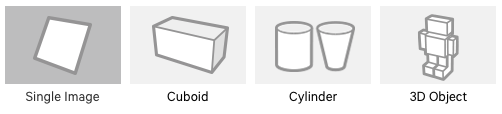

# Vuforia

 

Vuforia 是一个跨平台的增强现实 (AR) 和混合现实 (MR) 应用程序开发平台，可在各种硬件（包括移动设备和混合现实头戴式显示器 (HMD)，如 Microsoft HoloLens）上实现强大的跟踪和性能。Unity 的 Vuforia 集成允许开发者使用拖放式创作工作流程为 Android 和 iOS 创建视觉应用和游戏。Unity Asset Store 提供了一个 [Vuforia AR + VR 示例资源包](https://www.assetstore.unity3d.com/en/#!/content/101547)，其中有几个有用的示例演示了该平台最重要的功能。

Vuforia 支持许多第三方设备（例如 AR/MR 眼镜）和具有后置摄像头的 VR 设备（例如 Gear VR）。请参阅 Vuforia 的[设备 (Devices)](https://www.vuforia.com/Devices) 页面，查看受支持的设备的完整列表。请参阅 [Vuforia API 参考](https://library.vuforia.com/content/vuforia-library/en/reference/unity/index.html)，了解 SDK 中使用的类、属性和函数的更多相关信息。

可使用带摄像头的任何设备来测试使用 Vuforia 在 Unity 中构建的 AR/MR 游戏和应用程序。

## 重要概念

在进一步了解 Vuforia 及其支持的功能之前，需要了解许多重要概念。这些概念中包括 Vuforia 应用程序中常用的跟踪形式和标记类型。

### 基于标记的跟踪

在 AR 或 MR 中，标记是在应用程序中注册的图像或对象，它们在应用程序中充当信息触发器。当设备的摄像头在真实世界中识别到这些标记时（在运行 AR 或 MR 应用程序时），这会触发在摄像机视图中标记的世界位置上显示虚拟内容。基于标记的跟踪可以使用各种不同的标记类型，包括 QR 码、物理反射标记、图像目标和 2D 标签。游戏应用程序中最简单和最常见的标记类型是图像目标。

#### 图像目标

图像目标是基于标记的跟踪中使用的特定标记类型。它们是您手动向应用程序注册的图像，并充当显示虚拟内容的触发器。对于图像目标，应使用包含具有复杂轮廓的不同形状的图像。这样可以方便进行图像识别并让跟踪算法更容易识别它们。

### 无标记跟踪

使用无标记跟踪的应用更常见于基于定位或基于位置的增强现实或混合现实。这种跟踪形式依赖于诸如 GPS、加速度计、陀螺仪和更复杂的图像处理算法之类的技术，才能将虚拟对象或信息置于环境中。然后，VR 硬件和软件便会将这些对象视为锚定或连接到特定的真实世界位置或对象。

---
* 2018-03-28 Page published with [editorial review](DocumentationEditorialReview.html)

* 在 2017.3 版中更新了有关 Unity XR API 的 Vuforia 文档
