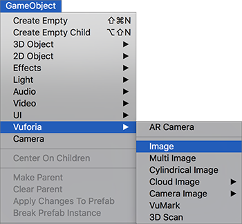
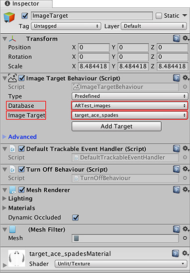

# 将图像目标添加到场景

要将图像目标添加到场景，请选择 __GameObject__ &gt; __Vuforia__ &gt; __Image__。

当图像目标游戏对象位于场景中后，选择该游戏对象并在 __Inspector__ 窗口中查看其组件。

在 __Image Target Behaviour__ 组件中，单击 __Database__ 下拉列表，然后选择目标数据库。在 __Image Target__ 下拉列表中，选择数据库中的图像目标的名称。

注意：无需单击 __Add Target__ 按钮，因为这会进入 Vuforia 网站，其中将提供有关向应用程序添加目标的信息。

最后一步是在 Vuforia 识别到图像目标时让 3D 游戏对象显示。

---
* 2018-03-28 Page published with [editorial review](DocumentationEditorialReview.html)

* 在 2017.3 版中更新了有关 Unity XR API 的 Vuforia 文档
