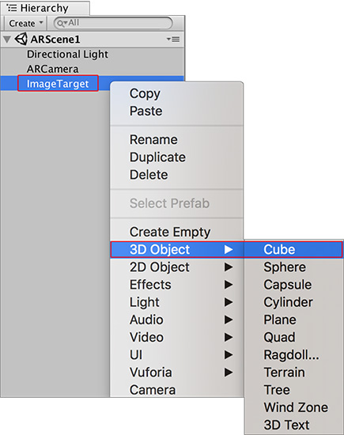
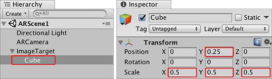
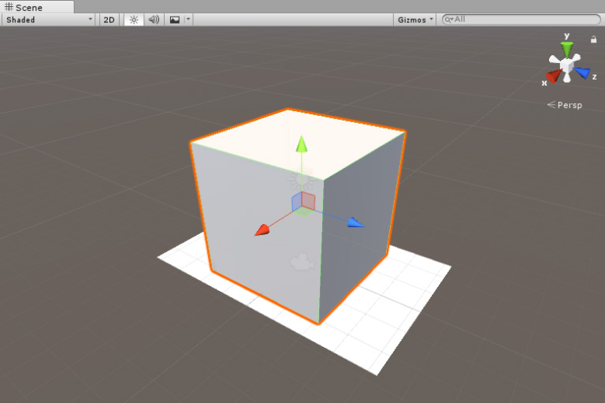
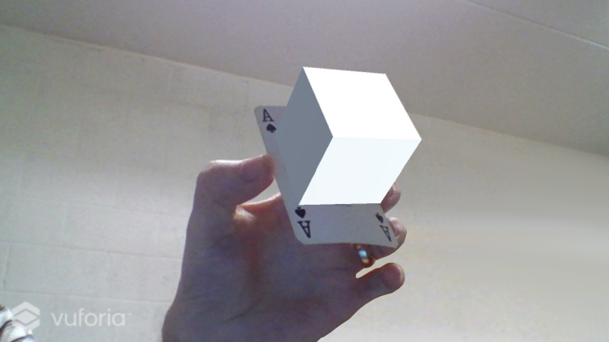

# 在跟踪的图像上显示 3D 模型

本页面介绍当摄像机识别并跟踪屏幕上的图像目标时如何显示游戏对象。

使游戏对象成为图像目标 (Image Target) 游戏对象的子代。此子代游戏对象必须同时包含 __MeshRenderer__ 和 __MeshFilter__ 组件。

添加立方体图元作为图像目标游戏对象的子代。为此，请右键单击该游戏对象，然后从弹出菜单中选择 __3D Object__ &gt; __Cube__。

现在缩放立方体游戏对象，将其移近图像目标游戏对象，使其看起来像是置放在目标图像上。使用 __Scene 视图__可判断游戏对象的位置。如果使用与本指南中的扑克牌相同的 __Width__，则将立方体游戏对象的 Transform 组件的 X、Y 和 Z Scale 值更改为 0.5，并将 __Transform Position__ Y 值更改为 0.25，使立方体在图像目标游戏对象上保持良好的置放状态。

场景应如下所示：

单击 Unity Editor 中的 Play 按钮可测试 AR 功能。将图像放在网络摄像头前面时，在 __Game__ 视图中立方体会显示在图像之上。

__ARCamera__ 上的 Camera 组件的默认 __Far Clipping Planes__ 设置为 2000。对于需要在较远距离进行图像跟踪的游戏或应用程序（例如需要 AR 或 MR 眼镜的游戏或应用程序），必须在 Unity 中调整 __Camera__ 组件的 __Far Clipping Planes__，并增加目标的大小以确保设备摄像头能够轻松跟踪目标。

现在已经成功制作了一个使用图像目标的简单应用程序，并在摄像机可以跟踪目标时显示一个基本 3D 形状。

---
* 2018-03-28 Page published with [editorial review](DocumentationEditorialReview.html)

* 在 2017.3 版中更新了有关 Unity XR API 的 Vuforia 文档
