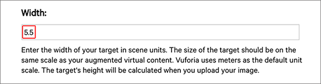
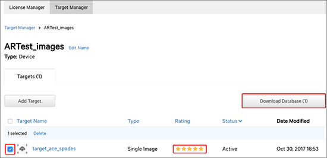

# 设置图像目标

本部分将介绍如何设置简单的图像目标并使其响应基本跟踪事件。

为了让应用程序识别图像并将其用作触发游戏、显示图形或信息的目标，需要创建一个__目标数据库__。可按本部分中的步骤所述，直接从 Vuforia 开发者门户 [Target Manager](https://developer.vuforia.com/Target-manager) 页面中创建目标数据库。

登录 [Vuforia 开发者帐户](https://developer.vuforia.com/user/login)。然后，导航到 [Target Manager](https://developer.vuforia.com/Target-manager) 页面，并单击 __Add Database__ 按钮。

在 __Create Database__ 页面上，输入数据库的名称，从 __Type__ 选项中选择 __Device__，然后单击 __Create__ 按钮。

此时会将新的目标数据库添加到 __Target Manager__ 列表。现在单击列表中的__数据库名称__以打开 __Device Database 列表__。

此时将显示数据库的__目标列表__页面，在此处可添加新的目标以及使用特定格式下载数据库以用于多种平台。单击 __Add Target__ 按钮可打开 __Add Target__ 弹出窗口。

__Add Target__ 窗口提供了多个选项来指定要添加的目标的详细信息。可添加四种不同类型的[目标](https://library.vuforia.com/articles/Solution/Targets.html)：Single Image、Cuboid/Box、Cylinder 和 3D Object。在 __Type__ 下，选择 __Single Image__，然后浏览硬盘驱动器以找到要用作图像目标的图像。

此示例使用扑克牌来演示 Unity 中的图像目标识别功能。

可使用任何图像，但请确保图像具有足够的细节可评定为 5 星目标，使摄像机可以轻松跟踪该目标。

__Width__ 值是一个缩放值，需要将其设置为希望图像在 Unity 场景中显示的大小（采用真实世界单位）。Unity 会根据目标图像的大小衡量场景中的所有对象。对于此示例，扑克牌的宽度为 5.5cm，因此要使用 _5.5cm_ 作为 __Width__ 值。如果需要更大尺寸的目标，则增加此 __Width__。

输入目标图像的名称，然后单击 __Add__ 按钮将图像目标上传到数据库。

该图像会显示在 Targets 列表中，其中 __Rating__ 值由星号表示。如果 __Rating__ 小于 5 星，摄像机可能难以跟踪该目标。要了解有关图像目标评级的影响因素的更多信息，请参阅有关[优化目标检测和跟踪稳定性 (Optimizing target detection and tracking stability)](https://library.vuforia.com/articles/Solution/Optimizing-Target-Detection-and-Tracking-Stability.html) 的 Vuforia 文档。

对图像的评级满意后，选中__图像目标__名称左侧的复选框，然后单击 __Download Database__ 按钮。

在 __Download Database__ 窗口上的 __Select a development platform__ 下面，选中 __Unity Editor__，然后单击 __Download__ 按钮。此时将下载目标数据库的 Unity 包，并可将其保存在硬盘驱动器上。

可切换回 Unity 项目，将 Unity 包导入，从而在应用程序中使用。

---
* 2018-03-28 Page published with [editorial review](DocumentationEditorialReview.html)

* 在 2017.3 版中更新了有关 Unity XR API 的 Vuforia 文档
